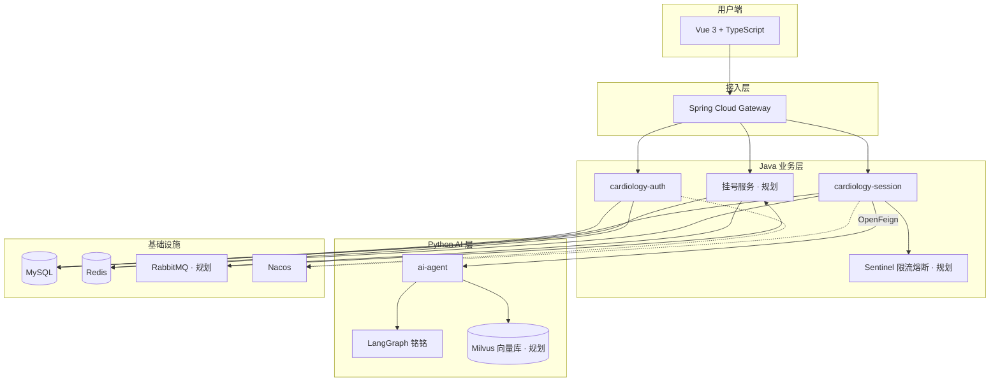
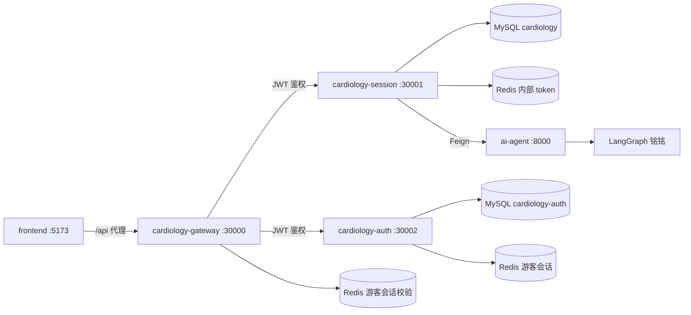

<div align="center">

# 🫀 Cardiology Intelligent Agent Platform

**心血管智能问诊 · 就医协助平台**

[](https://openjdk.org/)
[](https://spring.io/projects/spring-boot)
[](https://vuejs.org/)
[](https://www.typescriptlang.org/)
[](https://www.python.org/)
[](https://langchain-ai.github.io/langgraph/)
[](https://www.deepseek.com/)
[](https://www.rabbitmq.com/)
[](https://milvus.io/)
[](LICENSE)

[项目愿景](#项目愿景) · [架构](#系统架构) · [技术栈](#技术栈) · [子项目](#子项目) · [路线图](#路线图) · [快速开始](#快速开始) · [许可证](#许可证)

</div>

---

## 项目愿景

做一个 **能部署、能演示、能持续迭代** 的心血管健康产品。

用户从「我不舒服」出发，由 AI 助手 **铭铭** 完成初步问诊与缓急判断；需要就诊时，系统可 **异步协助挂号**，把「问清楚」和「约得上」连成完整链路。

> **定位**：健康信息辅助与就医引导，**不替代**医生诊断与处方。

---

## 系统架构

### 目标架构



### 当前已实现（MVP）



---

## 核心能力

| 能力 | 说明 | 状态 |
|------|------|------|
| 智能问诊 | LangGraph 分流：症状 / 既往史 / 化验 / 寒暄 / 拒答 | ✅ |
| 多轮对话 | `session` 作为 LangGraph `thread_id` | ✅ |
| 结构化输出 | `urgency` / `explanation` / `advice` / `disclaimer` | ✅ |
| 消息持久化 | 每轮 user + assistant 写入 MySQL | ✅ |
| 历史查询 | 按 session 游标分页拉取（`beforeId`） | ✅ |
| 内部鉴权 | Java → Python 一次性 Redis token | ✅ |
| 游客登录 | JWT 签发、Redis 会话缓存、`cardiology-auth` 独立库 | ✅ |
| 短信登录 | 图形验证码 + 阿里云短信验证码 + JWT（`formal` 用户） | ✅ |
| 网关 | Spring Cloud Gateway 统一入口、`/auth` / `/chat` 路由 | ✅ |
| Token 鉴权 | 网关 JWT 校验、游客 Redis 会话、透传 `X-User-Id` | ✅ |
| 会话创建 | `chat_session` 表、`POST /chat/session/create` | ✅ |
| 会话管理 | 列表分页 / 搜索、置顶、删除 | ✅ |
| 前端聊天 | 多轮问诊、历史加载、会话侧栏、打字指示、空状态 | ✅ |
| 操作级鉴权 | 未登录引导弹窗（游客 / 去登录）、登录回跳 | ✅ |
| 前端界面 | 登录 / 欢迎 / 聊天 / 帮助 / 隐私；记录 / 报告 / 挂号页骨架 | 🚧 |
| 第三方登录 | QQ、GitHub 等 | 📋 |
| Token 过期 | 401/403 自动清登录态并引导重登 | 📋 |
| 熔断限流 | Sentinel 保护 AI / 核心接口 | 📋 |
| 指南 RAG | Milvus 向量库检索心血管指南，增强铭铭作答 | 📋 |
| 异步挂号 | RabbitMQ 异步处理挂号任务，Seata 保障号源与订单多库一致 | 📋 |
| 结果通知 | 挂号成功 / 失败经 RabbitMQ 投递，推送用户通知 | 📋 |
| 云部署 | Docker Compose + Nginx 公网可访问 | 🚧 |

---

## 业务闭环（终局）

```text
登录 → 与铭铭问诊 → 获得缓急判断与建议
                    ↓
              聊天记录可查、可续聊
                    ↓
           需要就诊 → 提交挂号（异步）
                    ↓
         RabbitMQ 异步处理 → 成功 / 失败通知用户
```

**挂号设计要点**（规划）：

- **RabbitMQ**：异步挂号、削峰、失败重试、结果通知投递
- **Seata**：号源扣减与订单创建等多库强一致（自有服务范围内）
- 外部医院/HIS 通过消息队列解耦，采用最终一致性 + 补偿

**指南 RAG**（规划）：

- **Milvus**：存储心血管指南向量，`langchain-milvus` 检索增强铭铭回答依据

---

## 子项目

| 项目 | 路径 | 职责 | 文档 |
|------|------|------|------|
| Java 中间层 | [`services/cardiology-cloud`](services/cardiology-cloud/) | REST API、Feign、落库、微服务底座 | [README](services/cardiology-cloud/README.md) |
| 网关 | [`services/cardiology-cloud/cardiology-gateway`](services/cardiology-cloud/cardiology-gateway/) | 统一入口、JWT 鉴权、路由转发 | [Nacos 配置](services/cardiology-cloud/nacos-config/cardiology-gateway-server.yaml) |
| 认证服务 | [`services/cardiology-cloud/cardiology-auth`](services/cardiology-cloud/cardiology-auth/) | 游客 / 短信登录、JWT、用户表 | 见 [Nacos 配置](services/cardiology-cloud/nacos-config/cardiology-auth-server.yaml) |
| 会话服务 | [`services/cardiology-cloud/cardiology-session`](services/cardiology-cloud/cardiology-session/) | 问诊 API、会话管理、消息历史、Feign 调 AI | [README](services/cardiology-cloud/README.md) |
| Python AI | [`services/ai-agent`](services/ai-agent/) | 铭铭 · LangGraph 编排 | [README](services/ai-agent/README.md) |
| 前端 | [`frontend`](frontend/) | Vue 3 + TS 用户界面 | 见 [`.env.example`](frontend/.env.example) |
| 部署 | [`deploy`](deploy/) | 云服务器 Docker Compose 部署 | [README](deploy/README.md) |

---

## 技术栈

### 前端

Vue 3 · TypeScript · Vite · Pinia · Vue Router · Element Plus · Axios · Sass · vue-i18n（中 / 英）

### Java

Spring Boot 3.2 · Spring Cloud Gateway · Spring Cloud Alibaba · Nacos · OpenFeign · JWT · MyBatis-Plus · MySQL · Redis · 阿里云短信 · Sentinel（规划）· RabbitMQ（规划）· Seata（规划）

### Python

Django 6 · DRF · LangGraph · LangChain · DeepSeek V4 Flash · Milvus · langchain-milvus · Poetry

### 运维

Docker · Docker Compose · Nginx · 云服务器 · HTTPS（规划）

---

## 仓库结构

```text
CardiologyIntelligentAgent/          # Git 仓库根目录（.git 在此）
├── README.md
├── docker-compose.yaml              # 本地 MySQL / Redis / Nacos
├── docker-compose.prod.yaml         # 生产全栈 Compose
├── docker/mysql/init/               # 库表初始化（chat_message、chat_session 置顶字段等）
├── deploy/                          # 云部署脚本与说明
├── docs/                            # 项目文档
├── frontend/                        # Vue 3 + TS 前端
│   ├── src/views/                   # login / welcome / chat / help / privacy / records …
│   └── .env.development             # VITE_AUTH_API_BASE_URL 等
└── services/
    ├── cardiology-cloud/            # Java 微服务
    │   ├── cardiology-gateway/      # 网关 :30000 ✅
    │   ├── cardiology-auth/         # 认证服务 :30002 ✅
    │   ├── cardiology-session/      # 会话 & 问诊 API :30001 ✅
    │   ├── cardiology-cloud-common/
    │   └── nacos-config/
    └── ai-agent/                    # Python AI :8000 ✅
```

> **Monorepo 说明**：Git 根目录是 `CardiologyIntelligentAgent/`，不是 `frontend/`。在任意子目录执行 `git commit` 都会提交整个仓库中已 stage 的改动；习惯上在根目录操作更直观。

---

## 快速开始

### 环境要求

JDK 17 · Maven 3.9+ · Node.js 20+ · Yarn · Python 3.13+ · Poetry · Docker · MySQL 8 · Redis · Nacos · Milvus（规划）· RabbitMQ（规划）

### 0. 启动中间件

```bash
# 仓库根目录
docker compose up -d
```

启动 MySQL（`3306`）、Redis（`6379`）、Nacos（控制台 `8080`，客户端 `8848`）。  
`docker/mysql/init/` 会在首次启动时初始化 `cardiology` 库及 `chat_message` 表；若已有旧库，需手动执行 `03-chat-session-pinned.sql` 为 `chat_session` 增加置顶字段。

首次使用认证服务前，需创建独立库（若尚未存在）：

```sql
CREATE DATABASE IF NOT EXISTS `cardiology-auth`
  DEFAULT CHARACTER SET utf8mb4 COLLATE utf8mb4_unicode_ci;
GRANT ALL ON `cardiology-auth`.* TO 'cardiology'@'%';
```

将 [`nacos-config/`](services/cardiology-cloud/nacos-config/) 下三个配置文件导入 Nacos：

- `cardiology-gateway-server.yaml`
- `cardiology-auth-server.yaml`
- `cardiology-session-server.yaml`

> 网关 `jwt.sign-key` 须与 auth 服务保持一致。  
> 短信登录需在 `cardiology-auth-server.yaml` 配置 `aliyun.access-key-id` / `access-key-secret` 及 `auth.sms` 模板参数。

### 1. 启动 AI 服务

```bash
cd services/ai-agent
cp .env.example .env
poetry install --no-root
poetry run python manage.py runserver 0.0.0.0:8000
```

### 2. 启动 Java 服务

```bash
# cardiology-auth（认证）
cd services/cardiology-cloud/cardiology-auth
mvn spring-boot:run

# cardiology-session（问诊，另开终端）
cd services/cardiology-cloud/cardiology-session
mvn spring-boot:run

# cardiology-gateway（网关，另开终端；依赖 auth / session 已注册 Nacos）
cd services/cardiology-cloud/cardiology-gateway
mvn spring-boot:run
```

### 3. 启动前端

```bash
cd frontend
cp .env.example .env.development   # 若无则复制
yarn install
yarn dev
```

开发环境默认：

- 前端：`http://127.0.0.1:5173`
- 统一 API 入口：Vite 将 `/api` 代理到网关 `http://127.0.0.1:30000`（去掉 `/api` 前缀）
- Axios 基址：`VITE_AUTH_API_BASE_URL=http://127.0.0.1:30000`（登录、问诊均经网关）

### 4. 冒烟测试

```bash
# 游客登录（经网关）
LOGIN=$(curl -s -X POST http://127.0.0.1:30000/auth/guest/login/v1 \
  -H "Content-Type: application/json" \
  -d '{"guestId":"guest-demo-001"}')
TOKEN=$(echo "$LOGIN" | jq -r '.data.token')
UID=$(echo "$LOGIN" | jq -r '.data.id')

# 创建会话
curl -X POST http://127.0.0.1:30000/chat/session/create \
  -H "Content-Type: application/json" \
  -H "Authorization: Bearer $TOKEN" \
  -d "{\"uid\":\"$UID\",\"session\":\"session-001\"}"

# 问诊（需 JWT）
curl -X POST http://127.0.0.1:30000/chat/generalUnderstanding/v1 \
  -H "Content-Type: application/json" \
  -H "Authorization: Bearer $TOKEN" \
  -d "{\"uid\":\"$UID\",\"session\":\"session-001\",\"message\":\"我胸口疼\"}"
```

---

## API 概览

| 服务 | 方法 | 路径 | 鉴权 | 说明 |
|------|------|------|------|------|
| gateway → auth | `POST` | `/auth/guest/login/v1` | 无 | 游客登录，返回 JWT |
| gateway → auth | `POST` | `/auth/sms/login/captcha/v1` | 无 | 获取图形验证码 |
| gateway → auth | `POST` | `/auth/sms/login/sms/v1` | 无 | 发送短信验证码 |
| gateway → auth | `POST` | `/auth/sms/login/v1` | 无 | 短信验证码登录 |
| gateway → session | `POST` | `/chat/session/create` | JWT | 创建问诊会话 |
| gateway → session | `GET` | `/chat/session/list/v1` | JWT | 会话列表（分页 / 搜索） |
| gateway → session | `POST` | `/chat/session/pin/v1` | JWT | 置顶 / 取消置顶 |
| gateway → session | `DELETE` | `/chat/session/v1` | JWT | 删除会话 |
| gateway → session | `POST` | `/chat/generalUnderstanding/v1` | JWT | 普通医疗对话 |
| gateway → session | `GET` | `/chat/messages/v1` | JWT | 消息历史（游标分页） |

> 对外请求统一经网关 `:30000`；Python `POST /api/cardiology/general-understanding/` 仅供 Java Feign 内部调用。

---

## 路线图

| 阶段 | 内容 |
|------|------|
| **一期 · 已完成** | 铭铭问诊 MVP、消息落库、GitHub 开源 |
| **二期 · 已完成** | 游客认证、Gateway、JWT 鉴权、会话创建 |
| **三期 · 已完成** | 前端聊天全流程、会话管理、短信登录、操作级鉴权 |
| **四期 · 进行中** | 记录 / 报告 / 挂号页、Token 过期处理、第三方登录 |
| **五期** | Sentinel、云部署（Gateway / Auth 纳入 Compose） |
| **六期** | 见[核心能力](#核心能力)：异步挂号、结果通知、指南 RAG |
| **远期** | Redis AI 记忆、深度推理、多模态 |

---

## 许可证

本项目采用 [Apache License 2.0](LICENSE) 开源。

你可以自由使用、修改和分发本仓库代码，但需保留版权声明与许可证全文；若修改了文件，需标明变更。详见 [LICENSE](LICENSE)。

---

## 免责声明

本项目仅供健康信息参考与教育用途，**不能替代**专业医生的诊断、治疗与处方。如有不适，请及时就医。

开源许可证管代码使用权限；**医疗免责**管产品使用风险，二者互不替代。

---

<div align="center">

**作者** · zengxiangrui（曾祥瑞）  
zengxiangruiit@gmail.com

🌸 *铭铭在此，候君问脉* 🌸

</div>
