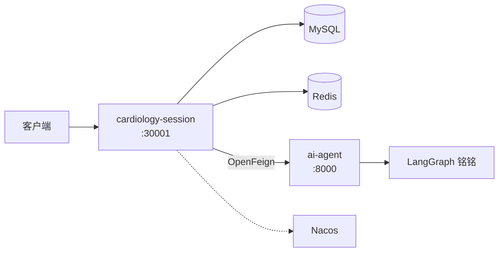

<div align="center">

# 🫀 Cardiology Intelligent Agent Platform

**心血管智能问诊分布式系统**

[](https://openjdk.org/)
[](https://spring.io/projects/spring-boot)
[](https://www.python.org/)
[](https://www.djangoproject.com/)
[](https://langchain-ai.github.io/langgraph/)
[]()

[快速开始](#快速开始) · [架构](#架构) · [子项目](#子项目) · [API](#api-概览)

</div>

---

## 简介

本项目是一个 **心血管智能问诊** 分布式系统，采用 Monorepo 管理。

- **Java 中间层**（`cardiology-cloud`）：对外 API、消息持久化、调用 AI 服务
- **Python AI 服务**（`ai-agent`）：LangGraph 驱动的问诊 Agent「铭铭」
- **前端**（`frontend`）：待开发

> ⚠️ 仅供健康信息参考，不能替代医生诊断与处方。

---

## 子项目

| 项目 | 路径 | 说明 | 文档 |
|------|------|------|------|
| Java 中间层 | `services/cardiology-cloud` | Spring Boot 微服务 | [README](services/cardiology-cloud/README.md) |
| Python AI | `services/ai-agent` | Django + LangGraph | [README](services/ai-agent/README.md) |
| 前端 | `frontend` | Web 客户端 | 待开发 |

---

## 架构



**调用流程：**

1. 客户端请求 `cardiology-session`
2. Java 写 Redis 内部 token，通过 Feign 调用 Python
3. Python 执行 LangGraph，返回结构化 JSON
4. Java 写入 MySQL 并响应客户端

---

## 仓库结构

```text
CardiologyIntelligentAgent/
├── README.md
├── frontend/
└── services/
    ├── cardiology-cloud/     # Java
    └── ai-agent/             # Python
```

---

## 环境要求

| 依赖 | 版本 |
|------|------|
| JDK | 17 |
| Maven | 3.9+ |
| Python | 3.13+ |
| Poetry | 最新 |
| MySQL | 8.0 |
| Redis | 6+ |
| Nacos | 2.x |

---

## 快速开始

### 1. 启动 AI 服务

```bash
cd services/ai-agent
cp .env.example .env
poetry install --no-root
poetry run python manage.py runserver 0.0.0.0:8000
```

### 2. 启动 Java 服务

```bash
# 启动 MySQL、Redis、Nacos，导入 nacos-config/cardiology-session-server.yaml

cd services/cardiology-cloud/cardiology-session
mvn spring-boot:run
```

### 3. 测试

```bash
curl -X POST http://127.0.0.1:30001/chat/generalUnderstanding/v1 \
  -H "Content-Type: application/json" \
  -d '{"uid":"user-001","session":"session-001","message":"我胸口疼"}'
```

---

## API 概览

| 方法 | 路径 | 说明 |
|------|------|------|
| `POST` | `/chat/generalUnderstanding/v1` | 普通医疗对话 |
| `GET` | `/chat/messages/v1` | 查询会话消息 |

Python 接口 `POST /api/cardiology/general-understanding/` 仅供 Java 内部调用。

---

## 开发进度

| 功能 | 状态 |
|------|------|
| LangGraph 分流问诊 | ✅ |
| 多轮 session | ✅ |
| Java ↔ Python 内部鉴权 | ✅ |
| 消息落库 | ✅ |
| API 网关 | 📋 规划中 |
| 认证服务 | 📋 规划中 |
| Redis Checkpoint | 📋 规划中 |

---

## 作者

**zengxiangrui**（曾祥瑞） · zengxiangruiit@gmail.com
