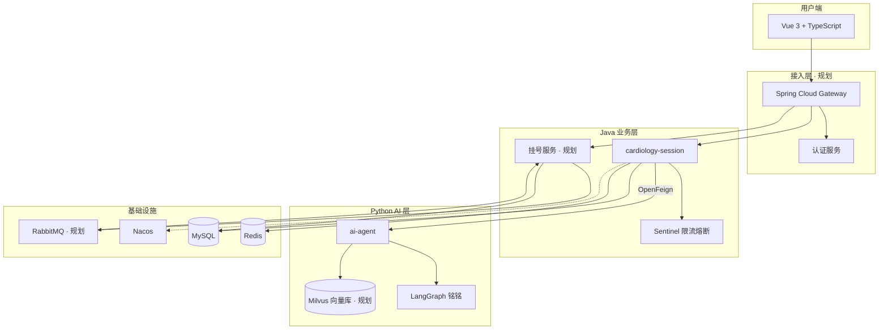
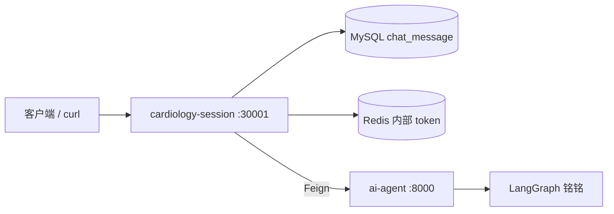

<div align="center">

# 🫀 Cardiology Intelligent Agent Platform

**心血管智能问诊 · 就医协助平台**

[](https://openjdk.org/)
[](https://spring.io/projects/spring-boot)
[](https://vuejs.org/)
[](https://www.typescriptlang.org/)
[](https://www.python.org/)
[](https://langchain-ai.github.io/langgraph/)
[](https://www.deepseek.com/)
[](https://www.rabbitmq.com/)
[](https://milvus.io/)

[项目愿景](#项目愿景) · [架构](#系统架构) · [技术栈](#技术栈) · [子项目](#子项目) · [路线图](#路线图) · [快速开始](#快速开始)

</div>

---

## 项目愿景

做一个 **能部署、能演示、能持续迭代** 的心血管健康产品。

用户从「我不舒服」出发，由 AI 助手 **铭铭** 完成初步问诊与缓急判断；需要就诊时，系统可 **异步协助挂号**，把「问清楚」和「约得上」连成完整链路。

> **定位**：健康信息辅助与就医引导，**不替代**医生诊断与处方。

---

## 系统架构

### 目标架构



### 当前已实现（MVP）



---

## 核心能力

| 能力 | 说明 | 状态 |
|------|------|------|
| 智能问诊 | LangGraph 分流：症状 / 既往史 / 化验 / 寒暄 / 拒答 | ✅ |
| 多轮对话 | `session` 作为 LangGraph `thread_id` | ✅ |
| 结构化输出 | `urgency` / `explanation` / `advice` / `disclaimer` | ✅ |
| 消息持久化 | 每轮 user + assistant 写入 MySQL | ✅ |
| 历史查询 | 按 session 拉取聊天记录 | ✅ |
| 内部鉴权 | Java → Python 一次性 Redis token | ✅ |
| 指南 RAG | Milvus 向量库检索心血管指南，增强铭铭作答 | 📋 |
| 前端界面 | Vue 3 + TypeScript 聊天页 | 📋 |
| 网关 / 认证 | 统一入口、登录鉴权 | 📋 |
| 熔断限流 | Sentinel 保护 AI / 核心接口 | 📋 |
| 异步挂号 | RabbitMQ 异步处理挂号任务，Seata 保障号源与订单多库一致 | 📋 |
| 结果通知 | 挂号成功 / 失败经 RabbitMQ 投递，推送用户通知 | 📋 |
| 云部署 | Docker + 公网可访问 | 📋 |

---

## 业务闭环（终局）

```text
登录 → 与铭铭问诊 → 获得缓急判断与建议
                    ↓
              聊天记录可查、可续聊
                    ↓
           需要就诊 → 提交挂号（异步）
                    ↓
         RabbitMQ 异步处理 → 成功 / 失败通知用户
```

**挂号设计要点**（规划）：

- **RabbitMQ**：异步挂号、削峰、失败重试、结果通知投递
- **Seata**：号源扣减与订单创建等多库强一致（自有服务范围内）
- 外部医院/HIS 通过消息队列解耦，采用最终一致性 + 补偿

**指南 RAG**（规划）：

- **Milvus**：存储心血管指南向量，`langchain-milvus` 检索增强铭铭回答依据

---

## 子项目

| 项目 | 路径 | 职责 | 文档 |
|------|------|------|------|
| Java 中间层 | [`services/cardiology-cloud`](services/cardiology-cloud/) | REST API、Feign、落库、微服务底座 | [README](services/cardiology-cloud/README.md) |
| Python AI | [`services/ai-agent`](services/ai-agent/) | 铭铭 · LangGraph 编排 | [README](services/ai-agent/README.md) |
| 前端 | [`frontend`](frontend/) | Vue 3 + TS 用户界面 | 待开发 |

---

## 技术栈

### 前端（规划）

Vue 3 · TypeScript · Vite

### Java

Spring Boot 3.2 · Spring Cloud · Spring Cloud Alibaba · Nacos · OpenFeign · MyBatis-Plus · MySQL · Redis · Sentinel · RabbitMQ（规划）· Seata（规划）

### Python

Django 6 · DRF · LangGraph · LangChain · DeepSeek V4 Flash · Milvus · langchain-milvus · Poetry

### 运维（规划）

Docker · Docker Compose · 云服务器 · HTTPS

---

## 仓库结构

```text
CardiologyIntelligentAgent/
├── README.md
├── frontend/                      # Vue 3 + TS
└── services/
    ├── cardiology-cloud/          # Java 微服务
    │   ├── cardiology-session/    # 会话 & 问诊 API ✅
    │   └── cardiology-cloud-common/
    └── ai-agent/                  # Python AI ✅
```

---

## 快速开始

### 环境要求

JDK 17 · Maven 3.9+ · Python 3.13+ · Poetry · MySQL 8 · Redis · Nacos · Milvus（规划）· RabbitMQ（规划）

### 1. 启动 AI 服务

```bash
cd services/ai-agent
cp .env.example .env
poetry install --no-root
poetry run python manage.py runserver 0.0.0.0:8000
```

### 2. 启动 Java 服务

```bash
# 启动 MySQL、Redis、Nacos
# 导入 services/cardiology-cloud/nacos-config/cardiology-session-server.yaml

cd services/cardiology-cloud/cardiology-session
mvn spring-boot:run
```

### 3. 冒烟测试

```bash
curl -X POST http://127.0.0.1:30001/chat/generalUnderstanding/v1 \
  -H "Content-Type: application/json" \
  -d '{"uid":"user-001","session":"session-001","message":"我胸口疼"}'
```

---

## API 概览

| 方法 | 路径 | 说明 |
|------|------|------|
| `POST` | `/chat/generalUnderstanding/v1` | 普通医疗对话 |
| `GET` | `/chat/messages/v1` | 查询会话消息历史 |

> Python `POST /api/cardiology/general-understanding/` 仅供 Java Feign 内部调用。

---

## 路线图

| 阶段 | 内容 |
|------|------|
| **一期 · 当前** | 铭铭问诊 MVP、消息落库、GitHub 开源 |
| **二期** | Vue 3 前端、Gateway、认证、Sentinel |
| **三期** | 云部署、线上可演示 |
| **四期** | 见[核心能力](#核心能力)：异步挂号、结果通知、指南 RAG |
| **远期** | Redis AI 记忆、深度推理、多模态 |

---

## 免责声明

本项目仅供健康信息参考与教育用途，**不能替代**专业医生的诊断、治疗与处方。如有不适，请及时就医。

---

<div align="center">

**作者** · zengxiangrui（曾祥瑞）  
zengxiangruiit@gmail.com

🌸 *铭铭在此，候君问脉* 🌸

</div>
