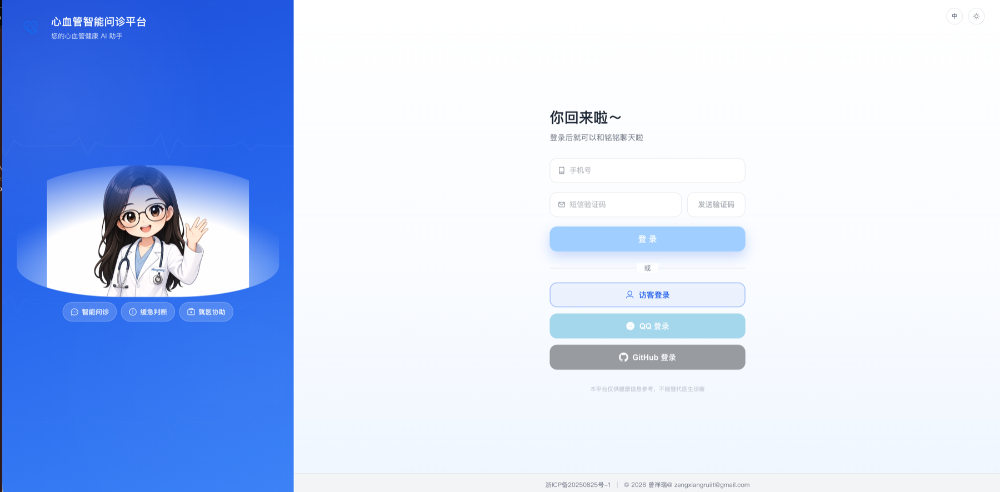
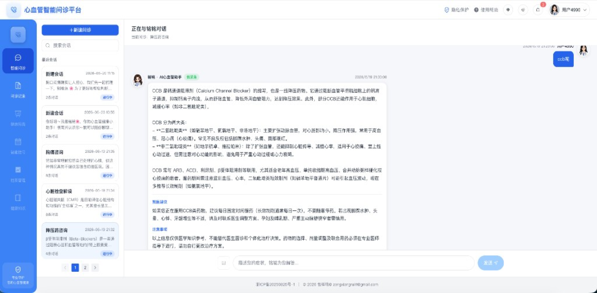
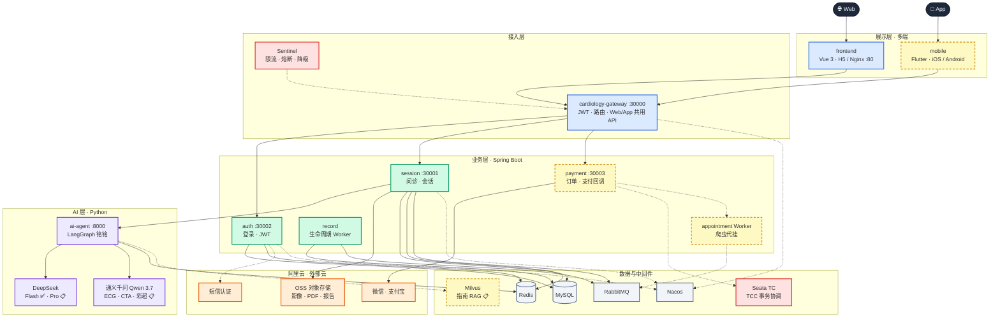
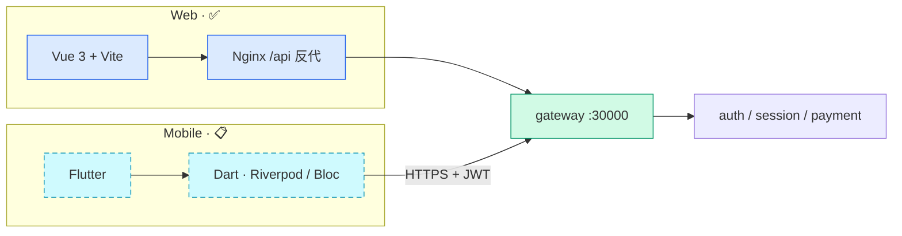
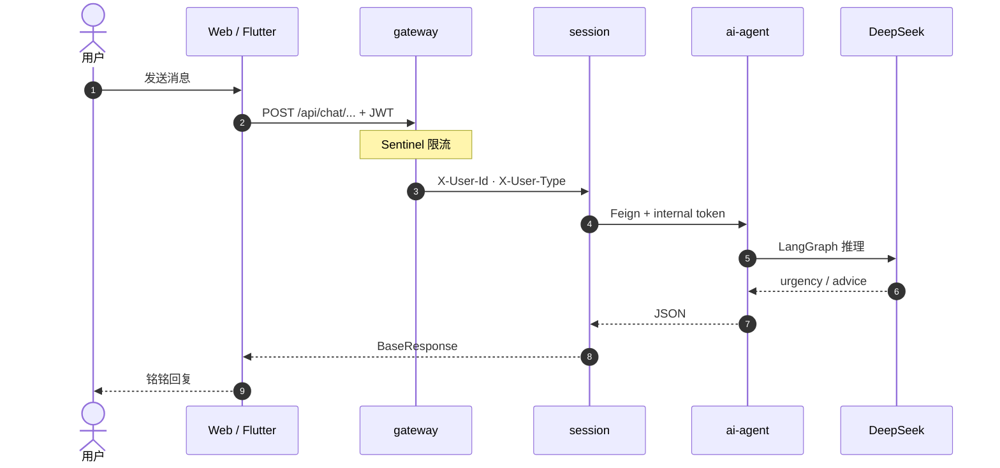
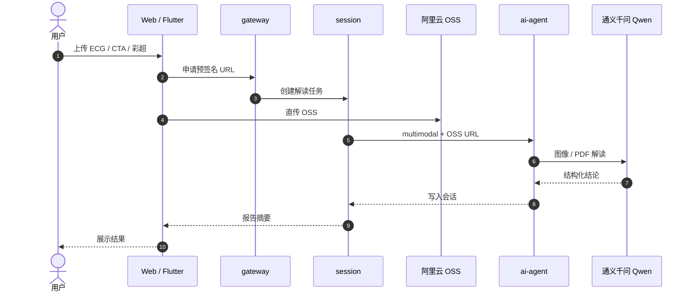
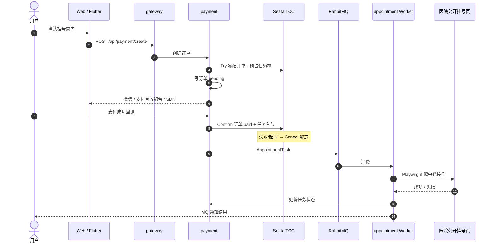
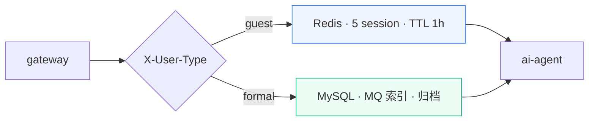
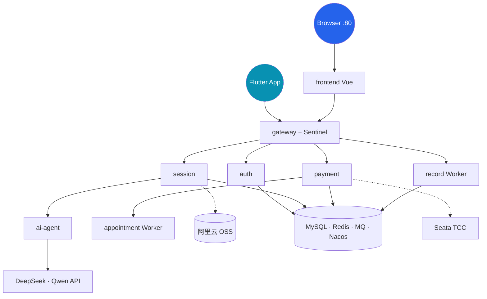

<div align="center">

# 🫀 Cardiology Intelligent Agent Platform

**心血管智能问诊 · 就医协助平台**

[](https://openjdk.org/)
[](https://spring.io/projects/spring-boot)
[](https://vuejs.org/)
[](https://flutter.dev/)
[](https://www.typescriptlang.org/)
[](https://www.python.org/)
[](https://langchain-ai.github.io/langgraph/)
[](https://www.deepseek.com/)
[](https://tongyi.aliyun.com/)
[](https://www.rabbitmq.com/)
[](https://milvus.io/)
[](https://www.aliyun.com/product/oss)
[](https://sentinelguard.io/)
[](https://seata.io/)
[](LICENSE)

[项目愿景](#项目愿景) · [界面预览](#界面预览) · [架构](#系统架构) · [技术栈](#技术栈) · [子项目](#子项目) · [快速开始](#快速开始) · [部署](#部署) · [版本管理](docs/release-process.md) · [路线图](#路线图) · [许可证](#许可证)

</div>

---

## 项目愿景

做一个 **能部署、能演示、能持续迭代** 的心血管健康产品。

用户从「我不舒服」出发，由 AI 助手 **铭铭** 完成初步问诊与缓急判断；需要就诊时，系统可 **异步协助挂号**，把「问清楚」和「约得上」连成完整链路。

> **定位**：健康信息辅助与就医引导，**不替代**医生诊断与处方。

---

## 界面预览

| 欢迎页 | 登录页 | 智能问诊 |
|--------|--------|----------|
|  |  |  |

当前 Web 端已覆盖 **游客登录、会话管理、多轮问诊、检查术语解读、问诊记录入口** 等核心体验；移动端、多模态、指南 RAG 与支付挂号仍在路线图中。

---

## 系统架构

### 全景架构（完整版）



| 分层 | 组件 | 职责 | 状态 |
|------|------|------|------|
| 展示 | **frontend**（Web） | 浏览器/H5、上传、支付收银台 | ✅ |
| 展示 | **mobile**（Flutter） | iOS / Android 原生壳、相机拍片、推送、SDK 支付 | 📋 |
| 接入 | gateway + **Sentinel** | 统一入口、JWT、**限流熔断**（AI / 核心 API） | Sentinel 📋 |
| 业务 | auth | 游客 / 短信登录 | ✅ |
| 业务 | session | 问诊、会话、多模态任务编排 | ✅ |
| 业务 | record | formal 生命周期、问诊总结 | 🚧 |
| 业务 | **payment** | 挂号/增值订单、**微信/支付宝**、回调对账 | 📋 |
| 业务 | **appointment Worker** | 爬虫代挂公开挂号页（无 HIS） | 📋 |
| AI | ai-agent | LangGraph · DeepSeek（文本）· Qwen（影像） | 文本 ✅ / 多模态 📋 |
| 数据 | MySQL · Redis · RabbitMQ · Nacos | 持久化、缓存、异步、配置 | ✅ |
| 治理 | **Seata TCC** | 支付 Try-Confirm-Cancel + 挂号任务确认/取消 | 📋 |
| 云 | **阿里云 OSS** | ECG / CTA / 彩超 / PDF 原文件与缩略图 | 📋 |
| 云 | 阿里云短信 | 登录验证码 | ✅（需配置） |
| 扩展 | Milvus | 心血管指南 RAG | 📋 |

> **多端**：Web（Vue）与 App（Flutter）**共用 gateway API** 与 JWT；App 直连 `https://<域名>/api` 或 gateway `:30000`，不经 Nginx 静态资源。  
> **存储**：影像与报告走 **阿里云 OSS**（预签名上传 / 内网读），元数据落 MySQL。  
> **支付**：`payment` 创建订单 → 唤起微信/支付宝 → 回调成功后 **Seata TCC Confirm**（订单已付 + 挂号任务入队）；失败或超时走 **Cancel** 回滚冻结资源。  
> **限流**：**Sentinel** 挂在 Gateway（及 Feign 调 ai-agent），防止 AI 接口被打爆。  
> **Seata TCC 边界**：仅覆盖**平台自有服务**（订单、任务、钱包）；**不对接 HIS**，号源以爬虫结果为准；Cancel 不保证外部医院页面已操作。

---

### 多端接入

Web 与 Flutter **同一套 REST API**，网关无差别鉴权；差异仅在端能力（相机、推送、原生支付 SDK）。



| 端 | 技术 | API 基址 | 特有能力 |
|----|------|----------|----------|
| Web | Vue 3 · TS · Element Plus | 开发 `:30000` · 生产 `/api` | 响应式布局、浏览器上传 |
| App | **Flutter** · Dart | `https://<域名>/api` 或 gateway | 相机/相册拍 ECG、**推送**、微信/支付宝 **SDK**、离线缓存 |

---

### 核心链路

#### 文本问诊（已上线）



#### 多模态解读（规划）



#### 支付 + 挂号（规划）



---

### AI 模型矩阵

| 能力 | 路由 | 模型 | 存储 | 状态 |
|------|------|------|------|------|
| 文本问诊 | `/general-understanding/` | DeepSeek V4 Flash | — | ✅ |
| 深度推理 | `/reasoning/` | DeepSeek Pro | — | 📋 |
| 多模态 | `/multimodal/` | Qwen 3.7 Plus | **OSS** | 📋 |
| ECG / Holter | multimodal | Qwen 3.7 Plus | OSS | 📋 |
| CTA / 冠脉 CT | multimodal | Qwen 3.7 Plus | OSS | 📋 |
| 心脏彩超 | multimodal | Qwen 3.7 Plus | OSS | 📋 |
| 化验 / 报告 PDF | multimodal + lab | Qwen 3.7 Plus | OSS | 📋 |
| 指南 RAG | LangGraph + 检索 | DeepSeek + Milvus | Milvus | 📋 |

---

### 问诊分流（guest / formal）



| | guest | formal |
|---|--------|--------|
| 存储 | Redis | MySQL |
| 上限 | 5 session · 30 问 · 1h | 30 问 · 15 天归档 · 7 天清理 |
| 置顶 | ❌ | ✅ |
| 多模态 OSS | 📋 规划 | 📋 规划 |

---

### 生产部署拓扑



前端开发时 `VITE_AUTH_API_BASE_URL=http://127.0.0.1:30000`，**必须经 gateway**，否则无 `X-User-Type`。  
生产编排见 [`docker-compose.prod.yaml`](docker-compose.prod.yaml) · [`deploy/README.md`](deploy/README.md)。

---

### formal 会话生命周期（仅 MySQL）

游客走 Redis TTL，**不参与**下列状态机。

```text
active ──(15 天无活跃，record 定时 Job)──► archived ──(再 7 天，record 定时 Job)──► 物理删除
```

| 阶段 | 执行方 | 行为 |
|------|--------|------|
| 活跃 | session | 问诊、`updated_at` 刷新；session-index MQ 更新 preview |
| 归档 | `cardiology-record` · `SessionLifecycleWorker.archiveInactiveSessions` | `status=archived`，写 `archived_at`，发 `SessionLifecycleArchivedEvent` |
| 拦截 | session | 列表只查 `active`；`archived` 会话拒绝继续问诊 |
| 清理 | `SessionLifecycleWorker.purgeExpiredArchivedSessions` | 删 `chat_message` + `chat_session` |
| MQ 消费 | `SessionLifecycleWorker.onSessionLifecycleArchived` | 收归档事件、打 log + ack（删库由定时 Job 负责） |

**RabbitMQ 拓扑**（`cardiology.mq.enabled=true` 时由 common-infra 声明）：

| 业务 | Queue | Routing Key | 生产者 | 消费者 |
|------|-------|-------------|--------|--------|
| session-index | `cardiology.session.index.queue` | `session.index.updated` | session | session |
| session-lifecycle | `cardiology.session.lifecycle.queue` | `session.lifecycle.archived` | record | record |

公共实体：`common-data/entity/chat/` 下 `ChatSessionEntity`、`ChatMessageEntity`；session / record 模块继承扩展。

SQL / Mapper：`docker/mysql/init/02-chat-session.sql` 等；record / session 的 `resources/mapper/*.xml`。

---

## 核心能力

| 能力 | 说明 | 状态 |
|------|------|------|
| 智能问诊 | LangGraph 分流：症状 / 既往史 / **用药** / 化验 / 寒暄 / 拒答 | ✅ |
| 深度推理 | 复杂病例链式分析 · DeepSeek Pro · `/reasoning/` | 📋 |
| 多模态解读 | 通义千问 Qwen 3.7 · `/multimodal/` · 图像 / PDF | 📋 |
| ECG / Holter 分析 | 静态 / 动态心电图影像解读 | 📋 |
| CTA / 冠脉 CT | 冠脉 CT、钙化积分等影像辅助解读 | 📋 |
| 心脏彩超 | 超声报告 / 截图结构化摘要 | 📋 |
| 化验单 / 报告 | 检验指标、影象报告 OCR + 解读 | 📋 |
| 用药咨询 | CCB / ARB 等药物类别科普，与 PMH 采集分离 | ✅ |
| Graph 路由调优 | 纯 LLM dispatch；lab 科普跳过 risk/referral；回忆类不猜名字 | ✅ |
| 多轮对话 | Java 加载最近 12 条 history → Feign → Python `state.messages`（无 checkpointer） | ✅ |
| 结构化输出 | `urgency` / `explanation` / `advice` / `disclaimer` | ✅ |
| 消息持久化 | formal：MySQL；guest：Redis（不写库） | ✅ |
| 游客会话 / 消息 | Redis + Lua 判限（5 session、30 user 问题、TTL 3600s） | ✅ |
| 会话索引异步更新 | formal 问诊 commit 后发 MQ，Consumer 更新 `chat_session` | ✅ |
| formal 会话生命周期 | 15 天 inactive 归档、7 天后 purge；session 侧拦截 archived | ✅ |
| RabbitMQ | 双 Queue（session-index + session-lifecycle）；common-infra 统一配置 | ✅ |
| 问诊记录 Worker | `cardiology-record` 无 HTTP；**生命周期 Job 已完成**，问诊总结 Job 待开发 | 🚧 |
| 历史查询 | 按 session 游标分页拉取（`beforeId`） | ✅ |
| 内部鉴权 | Java → Python 一次性 Redis token | ✅ |
| 游客登录 | JWT（`userType=guest`）、Redis 会话 1h、`cardiology-auth` 独立库 | ✅ |
| 短信登录 | 图形验证码 + 阿里云短信验证码 + JWT（`formal` 用户） | ✅ |
| 网关 | Spring Cloud Gateway 统一入口、`/auth` / `/chat` 路由 | ✅ |
| Token 鉴权 | 网关 JWT 校验、游客 Redis 会话、透传 `X-User-Id` + `X-User-Type` | ✅ |
| 会话创建 | 同一 API；guest→Redis、formal→`chat_session` 表 | ✅ |
| 会话管理 | 列表 / 搜索 / 删除；formal 支持置顶，guest 不支持 | ✅ |
| 提问上限 | 每 session 最多 **30 条 user 消息**（guest Lua / formal COUNT） | ✅ |
| Web 前端 | Vue 3 聊天、会话侧栏；经 gateway 区分 guest/formal | ✅ |
| **Flutter 移动端** | iOS / Android：问诊、拍片上传、推送、原生支付 SDK | 📋 |
| 操作级鉴权 | 未登录引导弹窗（游客 / 去登录）、登录回跳 | ✅ |
| 前端界面 | 登录 / 欢迎 / 聊天 / 帮助 / 隐私；记录 / 报告 / 挂号页骨架 | 🚧 |
| 第三方登录 | QQ、GitHub 等 | 📋 |
| Token 过期 | 401/403 自动清登录态并引导重登 | 📋 |
| 熔断限流 | **Sentinel**：Gateway 入口 + Feign→ai-agent 限流、熔断、降级 | 📋 |
| 分布式事务 | **Seata TCC**：Try 预占 → Confirm 提交 / Cancel 回滚（支付 + 挂号任务） | 📋 |
| 对象存储 | **阿里云 OSS**：多模态原文件、报告 PDF、预签名直传 | 📋 |
| 聚合支付 | **payment** 服务：微信 / 支付宝下单、回调、对账 | 📋 |
| 指南 RAG | Milvus 向量库检索心血管指南，增强铭铭作答 | 📋 |
| 异步挂号 | RabbitMQ 异步任务 + Python 爬虫/浏览器自动化代挂公开挂号页（**无 HIS 接口**） | 📋 |
| 结果通知 | 挂号成功 / 失败经 RabbitMQ 投递，推送用户通知 | 📋 |
| 云部署 | Docker Compose + Nginx | ✅ |

---

## 业务闭环（终局）

```text
登录 → 与铭铭问诊 → 上传 ECG/CTA（OSS + Qwen）
                    ↓
              聊天记录可查、可续聊
                    ↓
           需要就诊 → payment 下单（微信/支付宝）
                    ↓
         Seata TCC Confirm 已付 → 爬虫 Worker 代挂 → 通知结果
```

**支付 + 挂号**（规划）：

- **payment :30003**：创建订单、唤起微信/支付宝、处理异步回调。
- **Seata TCC**：
  - **Try**：冻结订单金额 / 预占挂号任务槽、写 pending 状态。
  - **Confirm**：支付回调成功 → 订单 `paid` + 挂号任务入 MQ。
  - **Cancel**：支付失败 / 超时 / 用户取消 → 解冻、关闭订单（**不涉及 HIS**）。
- **appointment Worker**：消费 MQ，Playwright 爬虫操作公开挂号页。
- **OSS**：影像类资料与挂号附件统一存 **阿里云 OSS**，业务库只存 key / URL。

**挂号约束**（外部方）：

- 作为非医院方，**无法对接 HIS / 官方号源 API**，只能针对医院**公开挂号页面**做爬虫 / Playwright 代操作。
- **RabbitMQ**：异步提交挂号任务、削峰、失败重试、结果通知。
- **任务状态**：号源与订单以**爬虫执行结果**为准，在自有库记录任务状态；不与 HIS 做分布式事务或强一致同步。
- **工程难点**：验证码、登录态、限流、页面改版；需按医院模板维护，Demo 可先支持少数固定渠道。
- **合规**：须评估目标站点服务条款与个人信息处理要求；产品定位为**就医协助 Demo**，不宣称官方合作。

**指南 RAG**（规划）：

- **Milvus**：存储心血管指南向量，`langchain-milvus` 检索增强铭铭回答依据

---

## 子项目

| 项目 | 路径 | 职责 | 文档 |
|------|------|------|------|
| Java 中间层 | [`services/cardiology-cloud`](services/cardiology-cloud/) | REST API、Feign、落库、微服务底座 | [README](services/cardiology-cloud/README.md) |
| 网关 | [`services/cardiology-cloud/cardiology-gateway`](services/cardiology-cloud/cardiology-gateway/) | 统一入口、JWT 鉴权、路由转发 | [Nacos 配置](services/cardiology-cloud/nacos-config/cardiology-gateway-server.yaml) |
| 认证服务 | [`services/cardiology-cloud/cardiology-auth`](services/cardiology-cloud/cardiology-auth/) | 游客 / 短信登录、JWT、用户表 | 见 [Nacos 配置](services/cardiology-cloud/nacos-config/cardiology-auth-server.yaml) |
| 会话服务 | [`services/cardiology-cloud/cardiology-session`](services/cardiology-cloud/cardiology-session/) | 问诊 API、会话管理、MQ 更新索引、Feign 调 AI | [README](services/cardiology-cloud/README.md) |
| 记录 Worker | [`services/cardiology-cloud/cardiology-record`](services/cardiology-cloud/cardiology-record/) | 无 HTTP；formal 会话生命周期 Job + MQ；问诊总结待开发 | [Nacos 配置](services/cardiology-cloud/nacos-config/cardiology-record-server.yaml) |
| 支付服务 | [`services/cardiology-cloud/cardiology-payment`](services/cardiology-cloud/cardiology-payment/) | 订单、微信/支付宝、**Seata TCC**（规划） | 📋 |
| Python AI | [`services/ai-agent`](services/ai-agent/) | 铭铭 · LangGraph 编排 | [README](services/ai-agent/README.md) |
| 前端 Web | [`frontend`](frontend/) | Vue 3 + TS · H5 / Nginx | 见 [`.env.example`](frontend/.env.example) |
| 移动端 | [`mobile`](mobile/) | **Flutter** · iOS / Android（规划） | 📋 |
| 部署 | [`deploy`](deploy/) | 云服务器 Docker Compose 部署 | [README](deploy/README.md) |

---

## 技术栈

### 前端 · Web

Vue 3 · TypeScript · Vite · Pinia · Vue Router · Element Plus · Axios · Sass · vue-i18n（中 / 英）

### 移动端

**Flutter** · Dart · Riverpod（或 Bloc）· Dio · go_router · 相机/相册 · 微信/支付宝 SDK · Firebase/APNs 推送（规划）

### Java

Spring Boot 3.2 · Spring Cloud Gateway · Spring Cloud Alibaba · **Sentinel** · **Seata TCC** · Nacos · OpenFeign · JWT · MyBatis-Plus · MySQL · Redis · **RabbitMQ** · **阿里云 OSS** · 阿里云短信 · 微信/支付宝

### Python

Django 6 · DRF · LangGraph · LangChain · **DeepSeek V4 Flash / Pro** · **通义千问 Qwen 3.7 Plus** · Milvus · langchain-milvus · Poetry

### 运维

Docker · Docker Compose · Nginx · **阿里云 OSS** · HTTPS（规划）

---

## 仓库结构

```text
CardiologyIntelligentAgent/          # Git 仓库根目录（.git 在此）
├── README.md
├── docker-compose.yaml              # 本地 MySQL / Redis / RabbitMQ / Nacos
├── docker-compose.prod.yaml         # 生产全栈 Compose
├── docker/mysql/init/               # 首次初始化（cardiology + cardiology-auth + 表结构）
├── docker/mysql/migrations/         # 旧库增量迁移（pinned / lifecycle 等）
├── deploy/                          # 云部署脚本与说明
├── docs/                            # 项目文档
├── frontend/                        # Vue 3 + TS Web 端 ✅
│   ├── src/views/                   # login / welcome / chat / help / privacy / records …
│   └── .env.development             # VITE_AUTH_API_BASE_URL 等
├── mobile/                          # Flutter iOS / Android 📋
│   ├── lib/                         # Dart 源码
│   └── pubspec.yaml
└── services/
    ├── cardiology-cloud/            # Java 微服务
    │   ├── cardiology-gateway/      # 网关 :30000 ✅
    │   ├── cardiology-auth/         # 认证服务 :30002 ✅
    │   ├── cardiology-session/      # 问诊 & 会话 API :30001 ✅（guest Redis + formal MySQL）
    │   ├── cardiology-record/       # 问诊记录 Worker（无 HTTP）· 生命周期 ✅
    │   ├── cardiology-payment/      # 支付服务 :30003 📋
    │   ├── cardiology-cloud-common/ # common-infra：Redis + RabbitMQ 自动配置
    │   └── nacos-config/
    └── ai-agent/                    # Python AI :8000 ✅
```

> **Monorepo 说明**：Git 根目录是 `CardiologyIntelligentAgent/`，不是 `frontend/`。在任意子目录执行 `git commit` 都会提交整个仓库中已 stage 的改动；习惯上在根目录操作更直观。

---

## 快速开始

### 环境要求

JDK 17 · Maven 3.9+ · Node.js 20+ · Yarn · Python 3.13+ · Poetry · Docker · MySQL 8 · Redis · RabbitMQ · Nacos · Milvus（规划）

### 0. 启动中间件

```bash
# 仓库根目录
docker compose up -d
```

启动 MySQL（`3306`）、Redis（`6379`）、RabbitMQ（AMQP `5672`，管理台 `15672`，账号 `cardiology/cardiology`）、Nacos（控制台 `8080`，客户端 `8848`）。  
`docker/mysql/init/` 会在 **MySQL 首次初始化** 时执行：创建 `cardiology`、`cardiology-auth` 库及 `chat_session` / `chat_message` / `user` 等表。  
**已有旧库**需手动补跑 `docker/mysql/migrations/` 下脚本（如 `03-chat-session-pinned.sql`、`04-chat-session-lifecycle.sql`）。

将 [`nacos-config/`](services/cardiology-cloud/nacos-config/) 下配置文件导入 Nacos：

- `cardiology-gateway-server.yaml`
- `cardiology-auth-server.yaml`
- `cardiology-session-server.yaml`（含 `spring.rabbitmq` 与 `cardiology.mq`）
- `cardiology-record-server.yaml`（Worker；`cardiology.mq.enabled: true`，含 `session-lifecycle` 配置）

> 网关 `jwt.sign-key` 须与 auth 服务保持一致。  
> **本地开发**：短信登录在 `cardiology-auth-server.yaml` 配置 `aliyun.access-key-id` / `access-key-secret` 及 `auth.sms` 模板。  
> **Docker 生产**：在 [`deploy/.env`](deploy/.env.example) 配置 `ALIYUN_ACCESS_KEY_ID` / `ALIYUN_ACCESS_KEY_SECRET`（见 [deploy/README.md](deploy/README.md)）。

### 1. 启动 AI 服务

```bash
cd services/ai-agent
cp .env.example .env
poetry install --no-root
poetry run python manage.py runserver 0.0.0.0:8000
```

### 2. 启动 Java 服务

```bash
# cardiology-auth（认证）
cd services/cardiology-cloud/cardiology-auth
mvn spring-boot:run

# cardiology-session（问诊，另开终端）
cd services/cardiology-cloud/cardiology-session
mvn spring-boot:run

# cardiology-record（formal 生命周期 Worker，建议与 session 同启）
cd services/cardiology-cloud/cardiology-record
mvn spring-boot:run
```

> **RabbitMQ**：启动 session / record 后日志应出现 **1 exchange / 2 queue**（session-index、session-lifecycle）。管理台：`http://127.0.0.1:15672`（`cardiology/cardiology`）。

```bash
# cardiology-gateway（网关，另开终端；依赖 auth / session 已注册 Nacos）
cd services/cardiology-cloud/cardiology-gateway
mvn spring-boot:run
```

### 3. 启动前端

```bash
cd frontend
cp .env.example .env.development   # 若无则复制
yarn install
yarn dev
```

开发环境默认：

- 前端：`http://127.0.0.1:5173`
- 统一 API 入口：Vite 将 `/api` 代理到网关 `http://127.0.0.1:30000`（去掉 `/api` 前缀）
- Axios 基址：`VITE_AUTH_API_BASE_URL=http://127.0.0.1:30000`（登录、问诊均经网关）

### 4. 冒烟测试

```bash
# 游客登录（经网关；请求体字段为 id）
LOGIN=$(curl -s -X POST http://127.0.0.1:30000/auth/guest/login/v1 \
  -H "Content-Type: application/json" \
  -d '{"id":"guest-demo-001"}')
TOKEN=$(echo "$LOGIN" | jq -r '.data.token')
UID=$(echo "$LOGIN" | jq -r '.data.id')

# 创建会话（网关自动注入 X-User-Type: guest）
curl -X POST http://127.0.0.1:30000/chat/session/create \
  -H "Content-Type: application/json" \
  -H "Authorization: Bearer $TOKEN" \
  -d "{\"uid\":\"$UID\",\"session\":\"session-001\"}"

# 问诊（第 31 条 user 消息将返回：本轮对话已达 30 个问题上限）
curl -X POST http://127.0.0.1:30000/chat/generalUnderstanding/v1 \
  -H "Content-Type: application/json" \
  -H "Authorization: Bearer $TOKEN" \
  -d "{\"uid\":\"$UID\",\"session\":\"session-001\",\"message\":\"我胸口疼\"}"
```

---

## API 概览

| 服务 | 方法 | 路径 | 鉴权 | 说明 |
|------|------|------|------|------|
| gateway → auth | `POST` | `/auth/guest/login/v1` | 无 | 游客登录，返回 JWT |
| gateway → auth | `POST` | `/auth/sms/login/captcha/v1` | 无 | 获取图形验证码 |
| gateway → auth | `POST` | `/auth/sms/login/sms/v1` | 无 | 发送短信验证码 |
| gateway → auth | `POST` | `/auth/sms/login/v1` | 无 | 短信验证码登录 |
| gateway → session | `POST` | `/chat/session/create` | JWT | 创建会话（guest→Redis，formal→MySQL） |
| gateway → session | `GET` | `/chat/session/list/v1` | JWT | 会话列表（分页 / 搜索） |
| gateway → session | `POST` | `/chat/session/pin/v1` | JWT | 置顶（仅 formal） |
| gateway → session | `DELETE` | `/chat/session/v1` | JWT | 删除会话 |
| gateway → session | `POST` | `/chat/generalUnderstanding/v1` | JWT | 问诊（30 条 user 上限） |
| gateway → session | `GET` | `/chat/messages/v1` | JWT | 消息历史（游标分页） |

> 对外请求统一经网关 `:30000`。网关鉴权通过后向下游注入 `X-User-Id`、`X-User-Type`（`guest` / `formal`），前端只需带 `Authorization: Bearer <token>`。  
> Python `POST /api/cardiology/general-understanding/` 仅供 Java Feign 内部调用。

---

## 部署

生产环境使用 [`docker-compose.prod.yaml`](docker-compose.prod.yaml)：

```bash
cp deploy/.env.example deploy/.env   # 填写数据库、JWT、DEEPSEEK_API_KEY 等
chmod +x deploy/deploy.sh
./deploy/deploy.sh up -d --build
```

浏览器访问 `http://<服务器IP>/`（Nginx 静态页 + `/api` 反代 gateway）。  
**Flutter App** 配置 `API_BASE_URL=https://<域名>/api`（或开发环境 `http://<IP>:30000`），与 Web **共用 JWT 与接口**。  
HTTPS、已有数据卷迁移、常见问题见 [deploy/README.md](deploy/README.md)。

---

## 路线图

| 阶段 | 内容 |
|------|------|
| **已完成** | 铭铭问诊 MVP、消息落库、游客/正式分流、Gateway、JWT 鉴权、会话管理、短信登录、formal 会话生命周期、Docker 全栈部署 |
| **进行中** | Web 记录/报告/挂号页、**Flutter 移动端**、问诊总结、多模态上传、payment；前端聊天体验优化 |
| **规划中** | Sentinel 全链路、Seata TCC、OSS 影像库、指南 RAG、爬虫代挂、DeepSeek Pro、App 推送 |

---

## 许可证

本项目采用 [Apache License 2.0](LICENSE) 开源。

你可以自由使用、修改和分发本仓库代码，但需保留版权声明与许可证全文；若修改了文件，需标明变更。详见 [LICENSE](LICENSE)。

---

## 免责声明

本项目仅供健康信息参考与教育用途，**不能替代**专业医生的诊断、治疗与处方。如有不适，请及时就医。

开源许可证管代码使用权限；**医疗免责**管产品使用风险，二者互不替代。

---

<div align="center">

**作者** · zengxiangrui（曾祥瑞）  
zengxiangruiit@gmail.com

🌸 *铭铭在此，候君问脉* 🌸

</div>
