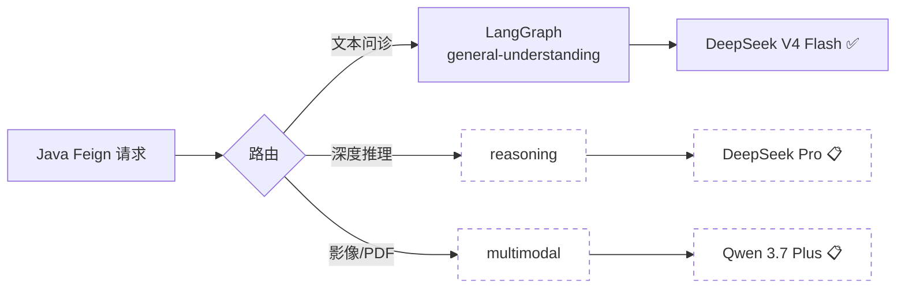
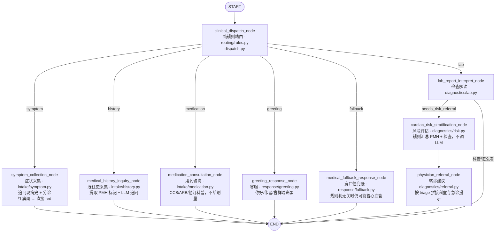

<div align="center">

# 🌸 Cardiology Intelligent Agent

**心血管智能问诊 Agent · 铭铭**

[](https://www.python.org/)
[](https://www.djangoproject.com/)
[](https://www.django-rest-framework.org/)
[](https://www.langchain.com/)
[](https://langchain-ai.github.io/langgraph/)
[](https://www.deepseek.com/)
[](https://tongyi.aliyun.com/)
[](https://python-poetry.org/)
[](https://redis.io/)

`services/ai-agent/`

[简介](#简介) · [LangGraph](#langgraph-工作流) · [多轮 LLM 统一架构](#多轮-llm-统一架构) · [graph 目录](#graph-目录导读) · [维护指南](#维护指南) · [启动](#快速开始) · [API](#api-文档)

</div>

---

## 简介

**ai-agent** 是心血管问诊系统的 Python AI 服务，核心角色是 **铭铭** —— 基于 LangGraph 的心血管健康咨询 Agent。

**主要能力：**

- 症状采集与分诊（`green` / `yellow` / `red`）
- **用药咨询**（CCB / ARB 等，独立 `medication` 节点）
- 既往史与危险因素询问
- 检查 / 化验报告解读
- 寒暄、自我介绍
- 非心血管话题拒答
- 多轮对话（PostgreSQL checkpointer；Java 不传 `history`）
- 结构化 JSON 输出

> ⚠️ 仅供健康信息参考，不能替代医生诊断与处方。

---

## 功能状态

| 接口 | 路由 | 模型 | 状态 |
|------|------|------|------|
| 普通问诊 | `POST /general-understanding/` | LangGraph + **DeepSeek V4 Flash** | ✅ |
| 深度推理 | `POST /reasoning/` | **DeepSeek Pro** | 📋 |
| 多模态 | `POST /multimodal/` | **通义千问 Qwen 3.7 Plus** | 📋 |

### 多模态覆盖（规划 · Qwen）

| 模态 | 示例输入 | 说明 |
|------|----------|------|
| ECG | 静态心电图、截图 | 心律、ST 段等辅助解读 |
| Holter | 动态心电图报告 | 24h 监测摘要 |
| CTA | 冠脉 CT、冠脉 CTA | 钙化积分、狭窄描述辅助 |
| 心脏彩超 | 超声报告 / 图像 | 结构、EF 等指标摘要 |
| 化验 / 报告 | PDF、检验单照片 | 与 `lab` 节点联动 |

---

## 模型路由



---

## 技术栈

| 类别 | 技术 |
|------|------|
| Web | Django 6.0 · DRF |
| Agent | LangGraph · LangChain |
| LLM | **DeepSeek V4 Flash**（文本）· **DeepSeek Pro**（推理，规划）· **通义千问 Qwen 3.7 Plus**（多模态，规划） |
| 多轮记忆 | **PostgreSQL checkpointer**（`PostgresSaver`，`thread_id=uid:session`）；Java 消息库仅用于前端展示 |
| 鉴权 | Redis 内部 token |
| 包管理 | Poetry |

---

## LangGraph 工作流

每轮用户消息的执行路径：



> **说明：** `lab` 有具体报告/异常时走 risk → referral；科普「怎么看」类单节点结束。其余 route 单节点后直接 END。

### 多轮 LLM 统一架构

所有多轮节点共用同一套管道，避免 greeting / symptom / fallback 各写各的：

```text
checkpoint 恢复 messages + state + 本轮 message
        ↓
resolve_route（纯规则 + sticky）  →  route
        ↓
业务节点（invoke_llm_json_with_retry 等）
        ↓
写回 checkpoint（messages + state 字段）
```

LLM 读上下文时，`graph/llm/messages.py` 的 `conversation_messages_for_llm` 仍只取 **最近 12 条**，assistant 截断 **480 字**，控制 token；checkpoint 内可存更长历史。

```text
prompts/llm/shared.py     →  CONVERSATION_RULES（回忆/不知道/不猜/不贴记录，只写一次）
        ↓
invoke_llm_json_with_retry →  temperature 0.3 → 0.1，失败返回 {}
        ↓
resolve_static_impression  →  LLM 全挂时按 route 选静态兜底（不猜名字）
```

| 模块 | 文件 | 职责 |
|------|------|------|
| 对话规则 | `prompts/llm/shared.py` | `with_conversation_rules()` 追加多轮规则 |
| LLM 调用 | `graph/llm/invoke.py` | `invoke_llm_json` / `invoke_llm_json_with_retry` |
| 多轮节点入口 | `graph/llm/conversation_node.py` | `run_standard_conversation_node()` |
| 静态兜底 | `prompts/fallback.py` | `resolve_static_impression(state, route)`；高危 symptom 不走长问卷 |
| 消息窗口 | `graph/llm/messages.py` | user 原文；assistant 截断 480 字再送 LLM |

**回忆类问题约定（LLM + 静态兜底一致）：**

- 上文有明确信息且确定在问本人 → 直接回答
- 没有 / 不确定 / 在问别人 → **诚实说不知道**，请用户补充
- 禁止猜测、禁止罗列聊天记录、禁止无关的通用自我介绍

> `lab` 分支由 LLM 字段 `needs_risk_referral` 决定：有具体报告/异常时走 risk → referral，科普「怎么看」类单节点结束。

### 节点注释（逐节点说明）

#### 1. `clinical_dispatch_node` — 意图路由（纯规则）

| 项 | 说明 |
|----|------|
| **文件** | `graph/routing/dispatch.py` · `graph/routing/rules.py`（`resolve_route`） |
| **触发** | 每轮入口（START 后第一个节点） |
| **输入** | checkpoint 恢复的 `state`（含 `messages`、`route`、`chief_complaint`、`triage_level` 等） |
| **逻辑** | ① 空消息 → `fallback` ② **关键词 + 会话语境**（症状延续 / lab 进行中 / 寒暄 / 用药 / 既往史 / 跑题）③ **sticky**：第 2 轮起若上一轮已是 `symptom|lab|medication|history` 且无明确换话题 → 保持原 route ④ 其余 → 默认 `symptom`。**不调 Router LLM** |
| **输出** | `{"route": "symptom\|history\|medication\|lab\|greeting\|fallback"}` |
| **改哪里** | 漏判/误判 → **只改** `routing/rules.py` + `tests/test_route_rules.py` |

#### 2. `symptom_collection_node` — 症状采集

| 项 | 说明 |
|----|------|
| **文件** | `graph/nodes/intake/symptom.py` |
| **适用** | 用户描述胸痛、心悸、气短等现病史 |
| **逻辑** | ① **部分缓解**（如「现在好多了」）≠ 症状结束，不清 red 锁 ② 用户明确说「完全好了」等 → LLM，可解除红旗 ③ **本轮**出现红旗词 → 固定 red 模板 ④ 高危语境下「一定要去吗」等急诊犹豫问题 → `ER_DOUBT_RED_FALLBACK` fast path，不调 LLM，不贴首轮 16 题问卷 ⑤ 否则 `run_standard_conversation_node`（LLM + 静态兜底）⑥ 曾 red / 高危语境 → 分诊至少 red |
| **输出** | `chief_complaint`、`triage_level`、`clinical_impression`、`management_advice`、`red_flag_suspected` |
| **改哪里** | 红旗词 → `prompts/symptom.py`；回答风格 → `prompts/llm/symptom_llm.py`；多轮规则 → `prompts/llm/shared.py` |

#### 3. `medical_history_inquiry_node` — 既往史采集

| 项 | 说明 |
|----|------|
| **文件** | `graph/nodes/intake/history.py` |
| **适用** | 用户聊高血压、糖尿病、冠心病史、吸烟、家族史等 |
| **逻辑** | 从全对话文本规则提取 PMH 布尔标记（高血压、糖尿病…）并 merge 到 state；高风险组合 → 上调 yellow；LLM 生成追问与回复 |
| **输出** | PMH 字段、`family_premature_cad`、`pmh_complete`、`triage_level`、回复三件套 |
| **改哪里** | 词表/组合规则 → `prompts/history.py`；LLM → `prompts/llm/history_llm.py` |

#### 4. `medication_consultation_node` — 用药咨询

| 项 | 说明 |
|----|------|
| **文件** | `graph/nodes/intake/medication.py` |
| **适用** | CCB、ARB、他汀、阿司匹林等用药疑问 |
| **逻辑** | 纯 LLM 节点：`run_standard_conversation_node`；科普机制、注意事项、何时复诊；**不推荐具体剂量** |
| **输出** | `triage_level`（通常 green）、`clinical_impression`、`management_advice`、`medical_disclaimer` |
| **改哪里** | `prompts/llm/medication_llm.py` |

#### 5. `greeting_response_node` — 寒暄与元对话

| 项 | 说明 |
|----|------|
| **文件** | `graph/nodes/response/greeting.py` |
| **适用** | 你好、你是谁、作者是谁、曾祥瑞彩蛋、「你喜欢谁」等 |
| **逻辑** | `run_standard_conversation_node` 读取 checkpoint messages；LLM 失败时走 `prompts/fallback.py` 静态兜底（作者/彩蛋/未知回忆） |
| **输出** | 通常 `triage_level=green`，友好介绍 + 引导回心血管话题 |
| **改哪里** | `prompts/llm/greeting_llm.py`；静态兜底 → `prompts/fallback.py` |

#### 6. `medical_fallback_response_node` — 宽口径兜底

| 项 | 说明 |
|----|------|
| **文件** | `graph/nodes/response/fallback.py` |
| **适用** | 规则认为明显非心血管时进入 |
| **逻辑** | `invoke_llm_json_with_retry` + 宽口径 Prompt；`is_off_topic=true` → 温和拒答；否则仍尝试答心血管 |
| **输出** | `triage_level=green` + 拒答或宽口径回答 |
| **改哪里** | `prompts/llm/fallback_llm.py`；静态兜底 → `prompts/fallback.py` |

#### 7. `lab_report_interpret_node` — 检查/化验解读（流水线 ①）

| 项 | 说明 |
|----|------|
| **文件** | `graph/nodes/diagnostics/lab.py` |
| **适用** | 化验单、心电图、超声、CTA 报告；术语科普（QRS、ST 段等） |
| **逻辑** | ① 全对话含危急关键词 → 固定 red ② 否则 LLM 解读，写入 `investigation_summary`；LLM 返回 `needs_risk_referral=false`（科普/无具体报告）→ 单节点结束，不跑 risk/referral |
| **输出** | `investigation_text`、`investigation_summary`、`lab_followup_needed`、分诊与回复 |
| **改哪里** | 危急词 → `prompts/lab.py`；解读 Prompt → `prompts/llm/lab_llm.py`；条件边 → `graph/builder.py` |

#### 8. `cardiac_risk_stratification_node` — 风险评估（流水线 ②）

| 项 | 说明 |
|----|------|
| **文件** | `graph/nodes/diagnostics/risk.py` |
| **适用** | 仅 `lab` 路径且 `lab_followup_needed=true` 时执行 |
| **逻辑** | **不调 LLM**；汇总 PMH 标记 + `investigation_summary` + `red_flag_suspected`，规则评估风险等级并可能上调 `triage_level` |
| **输出** | 追加风险摘要到 `clinical_impression`，追加分层建议到 `management_advice` |
| **改哪里** | `prompts/risk.py`（模板与分层文案） |

#### 9. `physician_referral_node` — 转诊建议（流水线 ③）

| 项 | 说明 |
|----|------|
| **文件** | `graph/nodes/diagnostics/referral.py` |
| **适用** | 仅 `lab` 路径且 `lab_followup_needed=true` 时最后一步 |
| **逻辑** | **不调 LLM**；按 `triage_level` 拼接推荐科室、 urgency、何时去急诊 |
| **输出** | 追加转诊文案到 `management_advice` |
| **改哪里** | `prompts/referral.py` |

### 意图路由（纯规则）

图的 **conditional edge 不由 AI 判断**，全部在 `routing/rules.py` 的 `resolve_route()` 中完成：

| 层级 | 机制 | 说明 |
|------|------|------|
| 1 | **关键词意图** | symptom / lab / medication / history / greeting / off-topic |
| 2 | **会话语境** | `chief_complaint`、`triage_level`、`red_flag_suspected`、全 thread 用户文本 |
| 3 | **sticky route** | 第 2 轮起保持上一轮 `symptom|lab|medication|history`，直到用户明确换话题 |
| 4 | **宽口径默认** | 其余一律 `symptom`（心血管 App 默认宽进） |
| 5 | **安全红旗** | 在 `nodes/intake/symptom.py` / `diagnostics/lab.py` 处理，不属于图的 conditional edge |

> `prompts/llm/router_llm.py` 已**停用**（历史遗留），勿再接入 dispatch。

**AI 只负责节点内生成回复**（追问、分诊文案、报告解读 JSON 等），不负责选边。

---

## graph 目录导读

建议阅读顺序（每个文件开头有中文模块注释）：

1. `graph/__init__.py` — 包入口，导出 `cardiology_graph`
2. `graph/builder.py` — 注册节点与边，`compile()` 成可执行图
3. `graph/state.py` — `CardiologyState` 全部字段及与 Java 返回映射
4. `graph/routing/dispatch.py` — 每轮第一步：意图路由
5. `graph/nodes/` — 业务节点（见下表）
6. `graph/llm/` — 公共工具（读消息、调 Flash、解析 JSON）

```text
cardiology_chat/graph/
├── __init__.py              # from cardiology_chat.graph import cardiology_graph
├── builder.py               # 图编排（原 director.py）
├── state.py                 # CardiologyState + empty_cardiology_state()
├── utils.py                 # 兼容层 → 转发到 graph.llm
│
├── llm/                     # 节点共用工具
│   ├── messages.py          # 构建 LLM 消息窗口（assistant 截断 480 字）
│   ├── conversation_node.py # run_standard_conversation_node（greeting/symptom/medication）
│   ├── keywords.py          # has_keyword（红旗、危急值等确定性规则）
│   ├── json_parser.py       # 解析 LLM 返回的 JSON
│   └── invoke.py            # invoke_llm_json / invoke_llm_json_with_retry
│
├── routing/                   # 意图路由层（纯规则，无 LLM）
│   ├── dispatch.py          # clinical_dispatch_node → resolve_route()
│   └── rules.py             # resolve_route：关键词 + sticky + 默认 symptom
│
└── nodes/
    ├── intake/              # 信息采集
    │   ├── symptom.py       # 症状 + 红旗（RED_FLAG_KEYWORDS）
    │   ├── history.py       # 既往史 + PMH 布尔标记提取
    │   └── medication.py    # 用药咨询
    ├── diagnostics/         # 检查解读（lab 路由；条件串联 risk/referral）
    │   ├── lab.py           # 报告/术语解读；needs_risk_referral 控制后续
    │   ├── risk.py          # 规则风险评估（不调 LLM）
    │   └── referral.py      # 转诊模板拼接
    └── response/            # 直接回复用户
        ├── greeting.py      # 寒暄 / 作者彩蛋
        └── fallback.py      # 宽口径兜底（规则判无关时仍可能答心血管问题）
```

### 节点与 Prompt 对应

| route | 节点文件 | LLM Prompt | 静态规则/模板 |
|-------|----------|------------|----------------|
| `symptom` | `nodes/intake/symptom.py` | `prompts/llm/symptom_llm.py` | `prompts/symptom.py`（红旗/缓解词）+ `prompts/fallback.py` |
| `history` | `nodes/intake/history.py` | `prompts/llm/history_llm.py` | `prompts/history.py` + `prompts/fallback.py` |
| `medication` | `nodes/intake/medication.py` | `prompts/llm/medication_llm.py` | `prompts/medication.py` + `prompts/fallback.py` |
| `lab` | `nodes/diagnostics/lab.py` | `prompts/llm/lab_llm.py` | `prompts/lab.py`（危急值词） |
| `greeting` | `nodes/response/greeting.py` | `prompts/llm/greeting_llm.py` | `prompts/fallback.py`（含彩蛋） |
| `fallback` | `nodes/response/fallback.py` | `prompts/llm/fallback_llm.py` | `prompts/fallback.py` |
| — | `nodes/diagnostics/risk.py` | 无 | `prompts/risk.py` |
| — | `nodes/diagnostics/referral.py` | 无 | `prompts/referral.py` |
| 路由 | `routing/dispatch.py` + `routing/rules.py` | **无** | 纯规则；sticky + 默认 `symptom` |
| 多轮规则 | 各 `*_llm.py` 经 `shared.py` | `prompts/llm/shared.py` | `CONVERSATION_RULES` |

### State 输出与 Java 映射

| Java `GeneralUnderstandingResponse` | `CardiologyState` 字段 |
|-------------------------------------|------------------------|
| `urgency` | `triage_level` |
| `explanation` | `clinical_impression` |
| `advice` | `management_advice` |
| `disclaimer` | `medical_disclaimer` |

---

## 维护指南

| 现象 | 优先改 |
|------|--------|
| 路由误判（如 QRS 进了 fallback） | `routing/rules.py` + `tests/test_route_rules.py` |
| 多轮短句丢上下文（如「一定要去吗」） | `routing/rules.py` sticky / `nodes/intake/symptom.py` 高危 fast path；确认 checkpoint 里 `route`/`chief_complaint` 已持久化 |
| 进了正确 route 但答非所问 | `prompts/llm/shared.py` + 对应 `*_llm.py`；确认 checkpoint messages 完整 |
| LLM 全挂后贴 16 题问卷 | `prompts/fallback.py` 的 `resolve_symptom_static_impression` |
| 回忆类问题 LLM 全挂 | `prompts/fallback.py`（`UNKNOWN_RECALL_FALLBACK`） |
| 铭铭回答风格/内容不对 | 对应 `prompts/llm/*_llm.py` |
| 科普「心电图怎么看」仍跑 risk/referral | `prompts/llm/lab_llm.py` 的 `needs_risk_referral` + `graph/builder.py` 条件边 |
| 红旗该触发没触发 | `prompts/symptom.py` + `nodes/intake/symptom.py` |
| 检查危急值规则 | `prompts/lab.py` + `nodes/diagnostics/lab.py` |
| 新增节点或改图结构 | `graph/builder.py` + 新建 `nodes/` 下文件 |
| 曾祥瑞 / 寒暄彩蛋 | `prompts/fallback.py` + `prompts/llm/greeting_llm.py` |

**不要**在业务节点里重复堆路由关键词；新意图 / 多轮 sticky → **只改** `routing/rules.py`，必要时加 specialist 节点。

---

## 项目结构

```text
services/ai-agent/
├── configuration/                 # Django settings
├── cardiology_chat/
│   ├── views.py · urls.py
│   ├── services/
│   │   └── chat_graph_service.py  # invoke + checkpoint thread_id
│   ├── graph/
│   │   ├── checkpointer.py        # PostgreSQL PostgresSaver
│   │   ├── routing/
│   │   │   ├── dispatch.py        # clinical_dispatch_node
│   │   │   └── rules.py           # resolve_route（纯规则 + sticky）
│   ├── prompts/
│   │   ├── llm/                   # 各节点 System Prompt（Router 已停用）
│   │   │   └── shared.py          # CONVERSATION_RULES（多轮统一规则）
│   │   └── *.py                   # 静态文案（红旗词、fallback、转诊模板等）
│   ├── factory/LLMFactory.py      # DeepSeek Flash 实例
│   ├── middlewares/               # X-Internal-Token 校验
│   └── infra/redis_client.py
├── common/
├── tests/
│   └── test_route_rules.py        # 纯规则路由单测
│   └── test_symptom_routing.py    # 症状 resolved / 高危就医确认 fast path 单测
├── .env.example
└── manage.py
```

---

## 快速开始

### 环境

- Python 3.13+
- Poetry
- DeepSeek API Key
- Redis（内部 token）
- **PostgreSQL**（LangGraph checkpointer；`docker compose up -d postgres`）

### 安装

```bash
cd services/ai-agent
cp .env.example .env
poetry install --no-root
```

### 配置 `.env`

```env
DJANGO_SECRET_KEY=your-secret-key
DEEPSEEK_API_KEY=sk-xxxxxxxx
REDIS_HOST=127.0.0.1
REDIS_PORT=6379
REDIS_DB=0
POSTGRES_HOST=127.0.0.1
POSTGRES_PORT=5432
POSTGRES_USER=cardiology
POSTGRES_PASSWORD=cardiology
POSTGRES_DB=cardiology
```

### 启动

```bash
poetry run python manage.py runserver 0.0.0.0:8000
```

访问：`http://127.0.0.1:8000/api/cardiology/`

---

## API 文档

### POST `/api/cardiology/general-understanding/`

> 仅供 Java Feign 调用，需 `X-Internal-Token` 请求头。

**请求体：**

```json
{
  "uid": "user-001",
  "session": "session-001",
  "message": "我哪里疼你还记得吗"
}
```

| 字段 | 必填 | 说明 |
|------|------|------|
| `uid` | 是 | 用户 ID，参与 `thread_id`（`uid:session`） |
| `session` | 是 | 会话 ID，checkpointer 线程键 |
| `message` | 是 | 当前轮用户输入（追加到 checkpoint messages） |

**删会话 checkpoint：** `POST /api/cardiology/checkpoint/delete/`（内部 token，body 同 `uid` + `session`）。

**响应：**

```json
{
  "code": 200,
  "message": "success",
  "data": {
    "urgency": "yellow",
    "explanation": "...",
    "advice": "...",
    "disclaimer": "..."
  }
}
```

### 输出字段

| 字段 | 内部字段 | 取值 |
|------|----------|------|
| `urgency` | `triage_level` | `""` / `green` / `yellow` / `red` |
| `explanation` | `clinical_impression` | 主回复 |
| `advice` | `management_advice` | 建议 |
| `disclaimer` | `medical_disclaimer` | 免责声明 |

---

## 多轮对话

```python
# chat_graph_service.py
config = {"configurable": {"thread_id": f"{uid}:{session}"}}
graph.invoke({"messages": [HumanMessage(content=message)]}, config=config)
# 答完后把 explanation 写回 checkpoint
graph.update_state(config, {"messages": [AIMessage(content=explanation)]})
```

| 组件 | 作用 |
|------|------|
| **PostgreSQL checkpointer** | 跨轮持久化 messages 与 state；LLM 从 checkpoint 读上下文 |
| **Java Redis/MySQL 消息** | 仅前端展示；不参与 Feign 上下文 |
| **`conversation_messages_for_llm`** | 调 LLM 时仍只取最近 12 条，assistant 480 字截断 |

图内 `clinical_state`（hpi、pmh、investigation 等）**随 checkpoint 跨轮保留**；删会话或调 `checkpoint/delete/` 时清除。

**本地 smoke test：**

```bash
cd services/ai-agent
poetry run python -m unittest tests.test_route_rules -v
poetry run python -m unittest tests.test_symptom_routing -v
```

---

## 内部鉴权

```text
Java → Redis SET internal:token:{uuid} = ok (TTL 60s)
     → Feign Header: X-Internal-Token
Python → 校验后删除
```

---

## 环境变量

| 变量 | 必填 | 说明 |
|------|------|------|
| `DJANGO_SECRET_KEY` | 是 | Django 密钥 |
| `DEEPSEEK_API_KEY` | 是 | DeepSeek Key |
| `REDIS_HOST` | 是 | 内部 token 校验 |
| `POSTGRES_*` / `POSTGRES_CHECKPOINTER_URI` | 是 | LangGraph checkpointer |
| `REDIS_PORT` | 否 | 默认 6379 |
| `QIANWEN_API_KEY` | 否 | 多模态（规划） |
| `LANGCHAIN_TRACING_V2` | 否 | LangSmith |

---

## 路线图

| 功能 | 状态 |
|------|------|
| LangGraph 意图路由（纯规则 + sticky，无 Router LLM） | ✅ |
| 多轮 LLM 统一架构（shared / conversation_node / fallback） | ✅ |
| lab 条件流水线（科普跳过 risk/referral） | ✅ |
| 用药咨询节点（medication） | ✅ |
| 多轮 session（PostgreSQL checkpointer + LLM 12 条窗口） | ✅ |
| 内部 token 鉴权 | ✅ |
| 寒暄 / 作者彩蛋 | ✅ |
| graph 目录分层（routing / intake / diagnostics / response） | ✅ |
| LangGraph Checkpointer（PostgreSQL） | ✅ |
| LoRA 微调 + 本地推理 A/B | 📋 [docs/lora-finetune.md](../../docs/lora-finetune.md) |
| reasoning / multimodal（ECG · CTA · 彩超） | 📋 |
| SSE 流式 | 📋 |

---

## 作者

**zengxiangrui**（曾祥瑞） · zengxiangruiit@gmail.com

---

<div align="center">

[← 项目根目录](../../README.md) · [Java 中间层 →](../cardiology-cloud/README.md)

</div>
