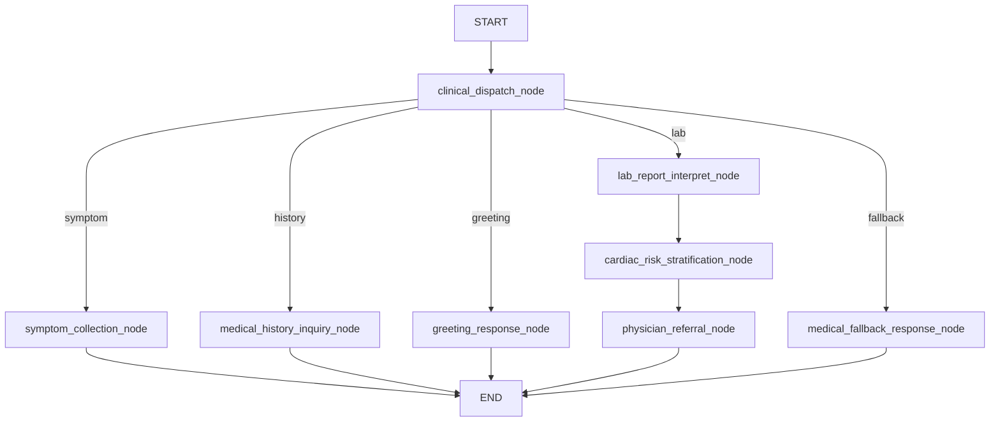

<div align="center">

# 🌸 Cardiology Intelligent Agent

**心血管智能问诊 Agent · 铭铭**

[](https://www.python.org/)
[](https://www.djangoproject.com/)
[](https://www.django-rest-framework.org/)
[](https://www.langchain.com/)
[](https://langchain-ai.github.io/langgraph/)
[](https://www.deepseek.com/)
[](https://python-poetry.org/)
[](https://redis.io/)

`services/ai-agent/`

[简介](#简介) · [LangGraph](#langgraph-工作流) · [启动](#快速开始) · [API](#api-文档)

</div>

---

## 简介

**ai-agent** 是心血管问诊系统的 Python AI 服务，核心角色是 **铭铭** —— 基于 LangGraph 的心血管健康咨询 Agent。

**主要能力：**

- 症状采集与分诊（`green` / `yellow` / `red`）
- 既往史与危险因素询问
- 检查 / 化验报告解读
- 寒暄、自我介绍
- 非心血管话题拒答
- 多轮对话（`session` → `thread_id`）
- 结构化 JSON 输出

> ⚠️ 仅供健康信息参考，不能替代医生诊断与处方。

---

## 功能状态

| 接口 | 路由 | 模型 | 状态 |
|------|------|------|------|
| 普通问诊 | `POST /general-understanding/` | LangGraph + DeepSeek Flash | ✅ |
| 深度推理 | `POST /reasoning/` | DeepSeek Pro | 📋 |
| 多模态 | `POST /multimodal/` | 通义千问 3.7 | 📋 |

---

## 技术栈

| 类别 | 技术 |
|------|------|
| Web | Django 6.0 · DRF |
| Agent | LangGraph · LangChain |
| LLM | DeepSeek V4 Flash |
| Checkpoint | InMemorySaver（开发环境） |
| 鉴权 | Redis 内部 token |
| 包管理 | Poetry |

---

## LangGraph 工作流



### 分流规则

| 输入示例 | 路由 | 说明 |
|----------|------|------|
| 我胸口疼 | `symptom` | 症状采集 |
| 我有高血压 | `history` | 既往史 |
| 帮我看心电图 | `lab` | 报告解读 |
| 你好 / 你是谁 | `greeting` | 寒暄 |
| 无关话题 | `fallback` | 拒答 |

---

## 项目结构

```text
services/ai-agent/
├── configuration/              # Django 配置
├── cardiology_chat/
│   ├── views.py
│   ├── urls.py
│   ├── serializers/
│   ├── services/chat_graph_service.py
│   ├── graph/
│   │   ├── director.py
│   │   ├── state.py
│   │   └── nodes/
│   ├── middlewares/internal_token.py
│   └── prompts/
├── common/common_data/
├── .env.example
└── manage.py
```

---

## 快速开始

### 环境

- Python 3.13+
- Poetry
- DeepSeek API Key
- Redis

### 安装

```bash
cd services/ai-agent
cp .env.example .env
poetry install --no-root
```

### 配置 `.env`

```env
DJANGO_SECRET_KEY=your-secret-key
DEEPSEEK_API_KEY=sk-xxxxxxxx
REDIS_HOST=127.0.0.1
REDIS_PORT=6379
REDIS_DB=0
```

### 启动

```bash
poetry run python manage.py runserver 0.0.0.0:8000
```

访问：`http://127.0.0.1:8000/api/cardiology/`

---

## API 文档

### POST `/api/cardiology/general-understanding/`

> 仅供 Java Feign 调用，需 `X-Internal-Token` 请求头。

**请求体：**

```json
{
  "uid": "user-001",
  "session": "session-001",
  "message": "我胸口疼"
}
```

| 字段 | 必填 | 说明 |
|------|------|------|
| `uid` | 是 | 用户 ID，仅做校验 |
| `session` | 是 | 会话 ID → LangGraph `thread_id` |
| `message` | 是 | 用户输入 |

**响应：**

```json
{
  "code": 200,
  "message": "success",
  "data": {
    "urgency": "yellow",
    "explanation": "...",
    "advice": "...",
    "disclaimer": "..."
  }
}
```

### 输出字段

| 字段 | 内部字段 | 取值 |
|------|----------|------|
| `urgency` | `triage_level` | `""` / `green` / `yellow` / `red` |
| `explanation` | `clinical_impression` | 主回复 |
| `advice` | `management_advice` | 建议 |
| `disclaimer` | `medical_disclaimer` | 免责声明 |

---

## 多轮对话

```python
thread_id = session.strip()
cardiology_graph.invoke(
    {"messages": [HumanMessage(content=message)]},
    config={"configurable": {"thread_id": thread_id}},
)
```

- `uid`：身份校验，不参与记忆
- `session`：多轮记忆键
- `message`：仅传当前轮输入

聊天记录由 Java `chat_message` 表持久化，本服务不访问 MySQL。

---

## 内部鉴权

```text
Java → Redis SET internal:token:{uuid} = ok (TTL 60s)
     → Feign Header: X-Internal-Token
Python → 校验后删除
```

---

## 环境变量

| 变量 | 必填 | 说明 |
|------|------|------|
| `DJANGO_SECRET_KEY` | 是 | Django 密钥 |
| `DEEPSEEK_API_KEY` | 是 | DeepSeek Key |
| `REDIS_HOST` | 是 | Redis 地址 |
| `REDIS_PORT` | 否 | 默认 6379 |
| `QIANWEN_API_KEY` | 否 | 多模态（规划） |
| `LANGCHAIN_TRACING_V2` | 否 | LangSmith |

---

## 路线图

| 功能 | 状态 |
|------|------|
| LangGraph 分流节点 | ✅ |
| 多轮 session | ✅ |
| 内部 token 鉴权 | ✅ |
| 寒暄 / 作者彩蛋 | ✅ |
| 分流关键词扩展 | ✅（症状 / 元对话 / 作者相关） |
| Redis Checkpoint | 📋 |
| reasoning / multimodal | 📋 |
| SSE 流式 | 📋 |

---

## 作者

**zengxiangrui**（曾祥瑞） · zengxiangruiit@gmail.com

---

<div align="center">

[← 项目根目录](../../README.md) · [Java 中间层 →](../cardiology-cloud/README.md)

</div>
