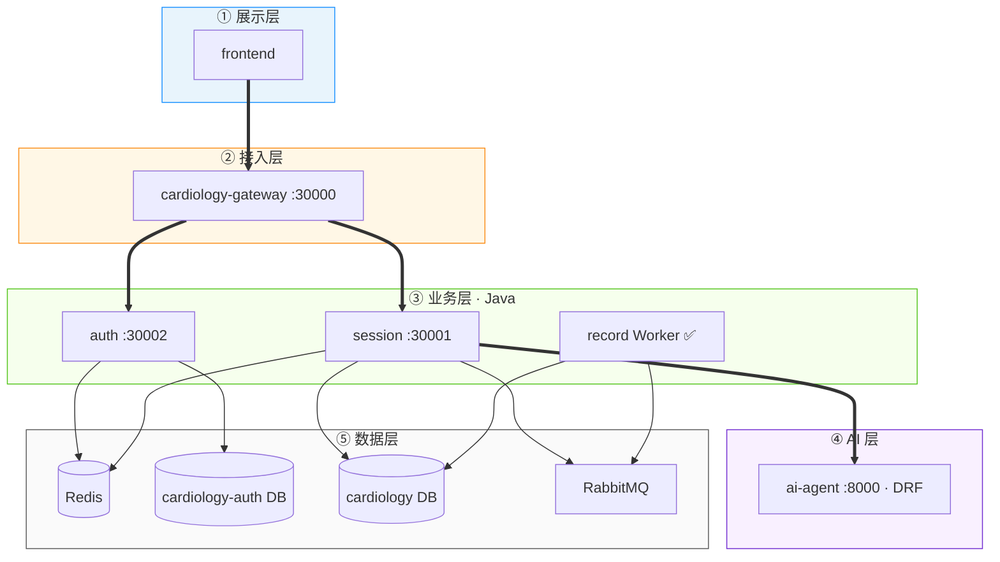
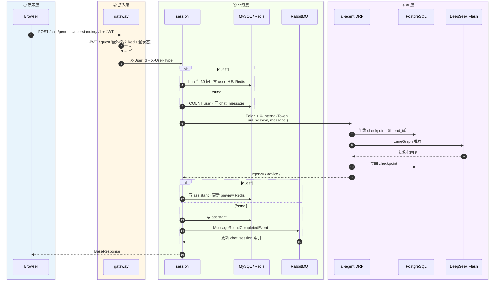

<div align="center">

# ☕ cardiology-cloud

**心血管智能问诊 · Java 中间层**

[](https://openjdk.org/)
[](https://spring.io/projects/spring-boot)
[](https://spring.io/projects/spring-cloud)
[](https://nacos.io/)
[](https://baomidou.com/)
[](https://www.mysql.com/)
[](https://redis.io/)

`services/cardiology-cloud/`

[简介](#简介) · [模块](#模块结构) · [启动](#快速开始) · [API](#api-文档)

</div>

---

## 简介

`cardiology-cloud` 是心血管问诊系统的 Java 侧工程，基于 Spring Boot 多模块构建。

当前可运行服务：

| 服务 | 端口 | 职责 |
|------|------|------|
| **cardiology-gateway** | `30000` | 统一入口、JWT 鉴权、路由转发 |
| **cardiology-auth** | `30002` | 游客 / 短信登录、JWT 签发、用户表 |
| **cardiology-session** | `30001` | 问诊 API、会话管理、**MQ 更新会话索引**、Feign 调 AI |
| **cardiology-record** | —（无 HTTP） | formal 会话生命周期 Worker（归档 / 清理）；空闲会话问诊总结 |

**主要职责：**

- 对外 REST API（经网关统一暴露）
- OpenFeign 调用 Python `ai-agent`
- Redis 内部 token 鉴权（Java → Python）
- 网关 JWT 鉴权与 `X-User-Id`、`X-User-Type` 透传
- **游客 / 正式用户分流**：同一套 `/chat/**` API，session 内按 `X-User-Type` 路由
- MyBatis-Plus 持久化**正式用户**聊天消息与会话
- **游客**会话与消息存 Redis（Lua 原子判限），不写 MySQL、不走 session-index MQ
- **RabbitMQ**：正式用户问诊 commit 后异步更新 `chat_session`（preview / message_count）
- **formal 会话生命周期**：record 定时归档（15 天无活跃）→ 清理（归档满 7 天）；session 侧列表只查 `active`、归档会话禁止继续问诊

---

## 技术栈

| 类别 | 技术 | 版本 |
|------|------|------|
| 语言 | Java | 17 |
| 框架 | Spring Boot | 3.2.4 |
| 微服务 | Spring Cloud | 2023.0.1 |
| 云原生 | Spring Cloud Alibaba | 2023.0.1.2 |
| 配置中心 | Nacos | 2.x |
| 网关 | Spring Cloud Gateway | — |
| 远程调用 | OpenFeign | — |
| ORM | MyBatis-Plus | 3.5.7 |
| 数据库 | MySQL | 8.0.33 |
| 缓存 | Redis | — |
| 消息队列 | RabbitMQ | 3.13（Compose） |

---

## 模块结构

```text
cardiology-cloud/
├── pom.xml
├── cardiology-cloud-common/
│   ├── cardiology-cloud-common-data/      # 统一响应、全局异常、ChatSession/Message 公共实体
│   ├── cardiology-cloud-common-infra/     # Redis + RabbitMQ 自动配置、MQ 事件 DTO
│   └── cardiology-cloud-common-utils/     # 工具类、AuthUserType、AuthHeaders
├── cardiology-gateway/                    # 网关 ✅
│   ├── filter/AuthenticationGlobalFilter
│   └── config/JwtConfig
├── cardiology-auth/                       # 认证服务 ✅
├── cardiology-session/                    # 会话服务 ✅
│   ├── controller/
│   ├── services/                          # 按 userType 分流 guest / formal
│   ├── store/GuestChatSessionStore        # 游客 Redis + Lua
│   ├── resources/lua/                     # guest_create_session / guest_append_user_message
│   ├── resources/mapper/                  # ChatSessionMapper.xml（列表只查 active）
│   ├── repository/
│   ├── entity/                            # 继承 common-data 实体父类
│   └── feign/
└── cardiology-record/                     # 记录 Worker ✅（无 Controller）
    ├── worker/SessionLifecycleWorker      # 归档 Job + 清理 Job + lifecycle MQ 监听
    ├── resources/mapper/                  # 生命周期 SQL（MyBatis XML）
    ├── resources/db/                      # DDL 脚本（04-chat-session-lifecycle.xml）
    └── properties/SessionLifecycleProperties
```

---

## 架构

### 六层位置（Java 在 ②③⑤ 层）



### 单次问诊时序（按层 · guest / formal）



> 前端**无需**传 `X-User-Type`；仅 JWT 经 `:30000` 即可。  
> **多模态**（规划）：上传 ECG / CTA / 彩超 → **阿里云 OSS** → ai-agent `/multimodal/` → **Qwen 3.7**，详见 [根 README · 全景架构](../../README.md#全景架构完整版)。

### 网关鉴权策略

| 用户类型 | 校验方式 |
|----------|----------|
| `guest` 游客 | JWT 签名 + Redis 会话（单点登录、踢下线） |
| `formal` 正式用户 | JWT 签名 + 过期时间 |
| 白名单 | `/auth/guest/login/**` 等免鉴权 |

鉴权通过后，网关向下游写入：

| 请求头 | 说明 |
|--------|------|
| `X-User-Id` | JWT 中的 `userId` |
| `X-User-Type` | `guest` 或 `formal` |

下游常量见 `AuthHeaders`（common-utils）。

### 游客 / 正式能力对照

| 能力 | 游客（Redis） | 正式用户（MySQL） |
|------|---------------|-------------------|
| 创建 / 列表 / 删除会话 | ✅ Lua + Redis | ✅ MySQL |
| 问诊聊天 | ✅ Redis | ✅ MySQL |
| 历史消息 | ✅ Redis LIST | ✅ `chat_message` |
| 置顶 | ❌ 返回业务错误 | ✅ |
| session-index MQ | ❌ | ✅ |
| 最多 session 数 | **5**（满了拒绝创建） | 暂未限制（规划同步） |
| 每 session 最多问题 | **30 条 user 消息**（Lua / COUNT） | **30 条 user 消息** |
| 数据 TTL | **3600s**（与 `auth.guest.time` 一致，读写续期） | 长期 |

### 游客 Redis Key

```text
cardiology:guest:session:{uid}                 # 登录态（auth 写入）
cardiology:guest:chat:{uid}:index              # ZSET，session 列表
cardiology:guest:chat:{uid}:s:{sessionId}      # HASH，meta（含 userMessageCount）
cardiology:guest:chat:{uid}:s:{sessionId}:msgs # LIST，JSON 消息
```

Lua 脚本：`resources/lua/guest_create_session.lua`、`guest_append_user_message.lua`。

---

## 快速开始

### 环境

- JDK 17、Maven 3.9+
- MySQL 8、Redis、**PostgreSQL**（ai-agent checkpointer）、**RabbitMQ**、Nacos
- Python `ai-agent` 已启动（`:8000`）

### 配置

| 环境 | profile | 业务配置来源 | Nacos 配置中心 | Nacos 服务发现 |
|------|---------|--------------|----------------|----------------|
| 本地 IDEA | `local` | Nacos public · `DEFAULT_GROUP` · `{app}.yaml` | ✅ `bootstrap.yml` | ✅ |
| Docker 生产 | `docker` | `application.yml` + `application-docker.yml` + `deploy/.env` | ❌ `bootstrap-docker.yml` | ✅ |

网关 `jwt.sign-key` 须与 auth 一致。

**Docker 生产**（profile `docker`）：`application-docker.yml` + `deploy/.env` 注入 `${JWT_SIGN_KEY}`、`${ALIYUN_ACCESS_KEY_*}` 等。

**RabbitMQ 拓扑（同一 Exchange，两个 Queue，由 common-infra 在 `cardiology.mq.enabled=true` 时声明）：**

| 业务 | Exchange | Queue | Routing Key | 生产者 | 消费者 |
|------|----------|-------|-------------|--------|--------|
| session-index | `cardiology.session.exchange` | `cardiology.session.index.queue` | `session.index.updated` | session | session |
| session-lifecycle（formal 归档） | 同上 | `cardiology.session.lifecycle.queue` | `session.lifecycle.archived` | record（你实现） | record（你实现） |

消息体：`MessageRoundCompletedEvent` / `SessionLifecycleArchivedEvent`（common-infra）。

`cardiology-session-server.yaml` 核心片段：

```yaml
spring:
  rabbitmq:
    host: 127.0.0.1
    port: 5672
    username: cardiology
    password: cardiology

cardiology:
  guest:
    chat:
      key-prefix: "cardiology:guest:chat:"
      ttl-seconds: 3600
      max-sessions: 5
      max-user-messages: 30
  mq:
    enabled: true
    session-index:
      exchange: cardiology.session.exchange
      queue: cardiology.session.index.queue
      routing-key: session.index.updated
    session-lifecycle:
      exchange: cardiology.session.exchange
      queue: cardiology.session.lifecycle.queue
      routing-key: session.lifecycle.archived
  ai-agent:
    base-url: http://127.0.0.1:8000/api/cardiology/
```

`cardiology-record-server.yaml`：`cardiology.mq.enabled: true`；**只消费** `session-lifecycle` 队列（不监听 session-index），并通过 `consultation-summary` 配置扫描 formal 空闲会话生成问诊记录。

`cardiology-session` 数据源等配置示例：

```yaml
server:
  port: 30001

spring:
  datasource:
    url: jdbc:mysql://127.0.0.1:3306/cardiology?useUnicode=true&characterEncoding=utf8&serverTimezone=Asia/Shanghai
    username: cardiology
    password: cardiology
  data:
    redis:
      host: 127.0.0.1
      port: 6379

cardiology:
  ai-agent:
    base-url: http://127.0.0.1:8000/api/cardiology/
```

### 启动

```bash
# 1. 认证服务
cd cardiology-auth && mvn spring-boot:run

# 2. 会话服务（另开终端；需 RabbitMQ）
cd cardiology-session && mvn spring-boot:run

# 3. 记录 Worker（可选，另开终端）
cd cardiology-record && mvn spring-boot:run

# 4. 网关（另开终端）
cd cardiology-gateway && mvn spring-boot:run
```

对外统一入口：`http://127.0.0.1:30000`

### 编译

```bash
mvn clean package -pl cardiology-session -am
mvn clean package -pl cardiology-auth -am
mvn clean package -pl cardiology-gateway -am
```

---

## API 文档

以下路径均经网关 `:30000` 访问；`/chat/**` 需 `Authorization: Bearer <token>`。

### POST `/auth/guest/login/v1`

游客登录（白名单，无需 JWT）。

**请求体：**

```json
{
  "id": "guest-demo-001"
}
```

**响应：** `data.token` 为 JWT（claim 含 `userType=guest`），`data.id` 为用户 ID。游客会话 Redis TTL 与 JWT 有效期均为 **3600s（1h）**（`auth.guest.time`）。

---

### POST `/auth/sms/login/captcha/v1`

获取图形验证码（白名单）。

**请求体：** `{ "phone": "13800138000" }`

**响应：** `data.captchaId`、`data.captchaImage`（Base64）。

---

### POST `/auth/sms/login/sms/v1`

发送短信验证码（白名单，需先通过图形验证码）。

**请求体：** `{ "phone": "...", "captchaId": "...", "captchaCode": "..." }`

---

### POST `/auth/sms/login/v1`

短信验证码登录（白名单），签发 `formal` 类型 JWT。

**请求体：** `{ "phone": "...", "code": "..." }`

**响应：** `data.token`、`data.id`、`data.phone` 等。

> **本地**：`aliyun.*` 与 `auth.sms.*` 在 Nacos `cardiology-auth-server.yaml`（阿里云 [号码认证](https://dypns.console.aliyun.com/) · `dypnsapi`）。  
> **生产 Docker**：`deploy/.env` 中 `ALIYUN_ACCESS_KEY_ID` / `ALIYUN_ACCESS_KEY_SECRET`。

---

### POST `/chat/session/create`

创建问诊会话。对外同一接口；**guest → Redis（Lua 限 5 个）**，**formal → MySQL**。

**请求体：**

```json
{
  "uid": "user-001",
  "session": "550e8400-e29b-41d4-a716-446655440000"
}
```

| 字段 | 必填 | 说明 |
|------|------|------|
| `uid` | 是 | 用户 ID |
| `session` | 是 | 客户端生成的 UUID；Java 侧会话持久化键（guest Redis / formal MySQL） |

**响应：** `data` 为 `ChatSession` 对象（含 `sessionId`、`title`、`status` 等）。

**业务错误（guest）：** 已有 5 个 session → `最多 5 个对话，请先删除后再创建`。

---

### GET `/chat/session/list/v1`

分页查询用户会话列表，支持关键词搜索。**guest 读 Redis，formal 读 MySQL**；响应结构一致。

**参数：** `uid`（必填）、`page`、`pageSize`、`keyword`

**响应：** `data.records` 为会话数组，`data.total` / `data.hasMore` 为分页信息；置顶会话优先排序。

---

### POST `/chat/session/pin/v1`

置顶或取消置顶会话。**仅 formal**；guest 返回「游客不支持置顶」。

**请求体：** `{ "uid": "...", "session": "...", "pinned": true }`

---

### DELETE `/chat/session/v1`

删除会话及其全部消息。**guest 删 Redis key；formal 物理删除 MySQL**（级联 `chat_message`）。同时 Feign 调 ai-agent `checkpoint/delete/` 清理 LangGraph state。

**参数：** `uid`、`session`

---

### POST `/chat/generalUnderstanding/v1`

普通医疗对话。**guest：Redis Lua 判 30 条 user 消息后写入；formal：MySQL COUNT 后写入**。Feign 仅传 `uid` / `session` / `message`；跨轮记忆由 ai-agent **PostgreSQL checkpointer** 承担（`thread_id = uid:session`）。Java 仍持久化全量消息供前端拉历史；删会话时会 Feign 调 `checkpoint/delete/` 清理 graph state。

**Feign 请求体：**

```json
{
  "uid": "user-001",
  "session": "session-001",
  "message": "我哪里疼你还记得吗"
}
```

**客户端请求体：**

```json
{
  "uid": "user-001",
  "session": "session-001",
  "message": "我胸口疼"
}
```

| 字段 | 必填 | 说明 |
|------|------|------|
| `uid` | 是 | 用户 ID |
| `session` | 是 | 会话 ID；Java 侧持久化键（guest Redis / formal MySQL） |
| `message` | 是 | 用户输入 |

**响应：**

```json
{
  "code": 200,
  "message": "success",
  "data": {
    "urgency": "yellow",
    "explanation": "...",
    "advice": "...",
    "disclaimer": "...",
    "guideReferences": ["国家基层高血压防治管理指南（2025版）"]
  }
}
```

| 字段 | 说明 |
|------|------|
| `guideReferences` | ai-agent RAG 命中时的参考指南中文名；未命中为 `[]` |

**持久化：** formal assistant 消息写入 `chat_message.guide_references`（JSON 数组字符串）；guest 写入 Redis 消息 JSON 的 `guideReferences` 字段。

**业务错误：** 本 session user 消息已达 30 条 → `本轮对话已达 30 个问题上限`。

---

### GET `/chat/messages/v1`

查询会话历史（游标分页，按时间升序返回当前页）。**guest 读 Redis LIST，formal 读 MySQL**。

**参数：**

| 参数 | 必填 | 说明 |
|------|------|------|
| `uid` | 是 | 用户 ID |
| `session` | 是 | 会话 ID |
| `beforeId` | 否 | 游标：加载此 ID 之前的更早消息 |
| `pageSize` | 否 | 每页条数，默认 40 |

**响应：** `data.records` 为消息数组（assistant 含 `guideReferences`），`data.hasMore` 表示是否还有更早记录。

---

## 数据库

### `chat_session`（仅 formal）

问诊会话元数据，由 `POST /chat/session/create` 写入 MySQL。列表中的 `message_count` 为 **user + assistant 合计**；30 条限制按 **user 消息** 计数。

| 字段 | 说明 |
|------|------|
| `session_id` | 会话 ID（主键） |
| `uid` | 归属用户 |
| `title` | 会话标题，默认「新建会话」 |
| `preview` | 最近消息摘要 |
| `message_count` | 消息条数 |
| `status` | `active` / `archived` |
| `pinned` | 是否置顶 |
| `pinned_at` | 置顶时间 |

### `chat_message`（仅 formal）

每轮问诊写入 `user` + `assistant` 两条记录；**不在同步链路双写** `chat_session`，由 MQ Consumer 异步更新 `preview` / `message_count` / `updated_at`。

| 字段 | 说明 |
|------|------|
| `session_id` | 会话 ID |
| `uid` | 用户 ID |
| `role` | `user` / `assistant` |
| `content` | 消息内容 |
| `urgency` ~ `disclaimer` | assistant 专有字段 |
| `guide_references` | assistant 专有；参考指南中文名 JSON 数组，如 `["国家基层高血压防治管理指南（2025版）"]` |

**迁移：** 已有库执行 `docker/mysql/migrations/06-chat-message-guide-references.sql`。

---

## 字段映射

| Python | Java |
|--------|------|
| `triage_level` | `urgency` |
| `clinical_impression` | `explanation` |
| `management_advice` | `advice` |
| `medical_disclaimer` | `disclaimer` |
| `context_bundle.guide_references` | `guideReferences`（API）→ `chat_message.guide_references`（formal 持久化） |

---

## 规划

| 模块 | 状态 |
|------|------|
| `cardiology-gateway` | ✅ 已完成 |
| `cardiology-auth` | ✅ 已完成（游客 + 短信） |
| `cardiology-session` | ✅ 已完成（guest Redis + formal MySQL 分流、MQ 会话索引） |
| `cardiology-record` | ✅ Worker；生命周期归档/清理 + `consultation_record` 总结 Job |
| Sentinel 限流熔断 | ✅ Gateway 问诊/Auth 限流 + Feign 降级（[sentinel-setup.md](../../docs/sentinel-setup.md)） |
| Seata TCC | 📋 Try-Confirm-Cancel · 支付 + 挂号任务 |

---

<div align="center">

[← 项目根目录](../../README.md) · [Python AI 服务 →](../ai-agent/README.md)

</div>
