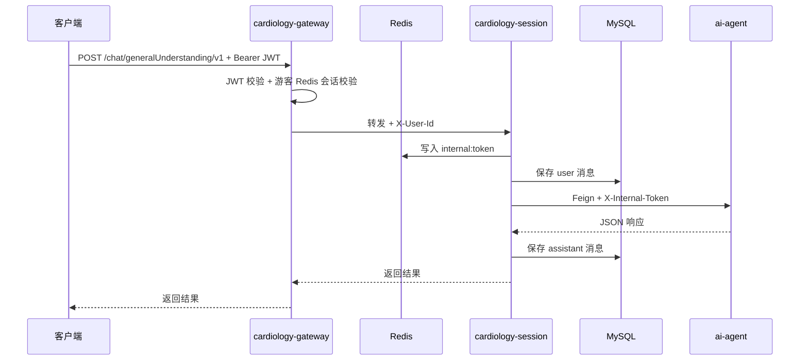

<div align="center">

# ☕ cardiology-cloud

**心血管智能问诊 · Java 中间层**

[](https://openjdk.org/)
[](https://spring.io/projects/spring-boot)
[](https://spring.io/projects/spring-cloud)
[](https://nacos.io/)
[](https://baomidou.com/)
[](https://www.mysql.com/)
[](https://redis.io/)

`services/cardiology-cloud/`

[简介](#简介) · [模块](#模块结构) · [启动](#快速开始) · [API](#api-文档)

</div>

---

## 简介

`cardiology-cloud` 是心血管问诊系统的 Java 侧工程，基于 Spring Boot 多模块构建。

当前可运行服务：

| 服务 | 端口 | 职责 |
|------|------|------|
| **cardiology-gateway** | `30000` | 统一入口、JWT 鉴权、路由转发 |
| **cardiology-auth** | `30002` | 游客 / 短信登录、JWT 签发、用户表 |
| **cardiology-session** | `30001` | 问诊 API、会话创建、消息历史、Feign 调 AI |

**主要职责：**

- 对外 REST API（经网关统一暴露）
- OpenFeign 调用 Python `ai-agent`
- Redis 内部 token 鉴权（Java → Python）
- 网关 JWT 鉴权与 `X-User-Id` 透传
- MyBatis-Plus 持久化聊天消息与会话

---

## 技术栈

| 类别 | 技术 | 版本 |
|------|------|------|
| 语言 | Java | 17 |
| 框架 | Spring Boot | 3.2.4 |
| 微服务 | Spring Cloud | 2023.0.1 |
| 云原生 | Spring Cloud Alibaba | 2023.0.1.2 |
| 配置中心 | Nacos | 2.x |
| 网关 | Spring Cloud Gateway | — |
| 远程调用 | OpenFeign | — |
| ORM | MyBatis-Plus | 3.5.7 |
| 数据库 | MySQL | 8.0.33 |
| 缓存 | Redis | — |

---

## 模块结构

```text
cardiology-cloud/
├── pom.xml
├── nacos-config/
│   ├── cardiology-gateway-server.yaml
│   ├── cardiology-auth-server.yaml
│   └── cardiology-session-server.yaml
├── cardiology-cloud-common/
│   ├── cardiology-cloud-common-data/      # 全局异常、统一响应
│   ├── cardiology-cloud-common-infra/     # Redis 配置
│   └── cardiology-cloud-common-utils/     # 工具类、AuthUserType
├── cardiology-gateway/                    # 网关 ✅
│   ├── filter/AuthenticationGlobalFilter
│   └── config/JwtConfig
├── cardiology-auth/                         # 认证服务 ✅
└── cardiology-session/                    # 会话服务 ✅
    ├── controller/
    ├── services/
    ├── repository/
    ├── entity/
    └── feign/
```

---

## 架构



### 网关鉴权策略

| 用户类型 | 校验方式 |
|----------|----------|
| `guest` 游客 | JWT 签名 + Redis 会话（单点登录、踢下线） |
| `formal` 正式用户 | JWT 签名 + 过期时间 |
| 白名单 | `/auth/guest/login/**` 免鉴权 |

鉴权通过后，网关将 `userId` 写入请求头 `X-User-Id` 供下游使用。

---

## 快速开始

### 环境

- JDK 17、Maven 3.9+
- MySQL 8、Redis、Nacos
- Python `ai-agent` 已启动（`:8000`）

### 配置

将 `nacos-config/` 下三个 YAML 导入 Nacos。网关 `jwt.sign-key` 须与 auth 服务一致。

`cardiology-session` 核心配置示例：

```yaml
server:
  port: 30001

spring:
  datasource:
    url: jdbc:mysql://127.0.0.1:3306/cardiology?useUnicode=true&characterEncoding=utf8&serverTimezone=Asia/Shanghai
    username: cardiology
    password: cardiology
  data:
    redis:
      host: 127.0.0.1
      port: 6379

cardiology:
  ai-agent:
    base-url: http://127.0.0.1:8000/api/cardiology/
```

### 启动

```bash
# 1. 认证服务
cd cardiology-auth && mvn spring-boot:run

# 2. 会话服务（另开终端）
cd cardiology-session && mvn spring-boot:run

# 3. 网关（另开终端；依赖 auth / session 已注册 Nacos）
cd cardiology-gateway && mvn spring-boot:run
```

对外统一入口：`http://127.0.0.1:30000`

### 编译

```bash
mvn clean package -pl cardiology-session -am
mvn clean package -pl cardiology-auth -am
mvn clean package -pl cardiology-gateway -am
```

---

## API 文档

以下路径均经网关 `:30000` 访问；`/chat/**` 需 `Authorization: Bearer <token>`。

### POST `/auth/guest/login/v1`

游客登录（白名单，无需 JWT）。

**请求体：**

```json
{
  "guestId": "guest-demo-001"
}
```

**响应：** `data.token` 为 JWT，`data.id` 为用户 ID。

---

### POST `/auth/sms/login/captcha/v1`

获取图形验证码（白名单）。

**请求体：** `{ "phone": "13800138000" }`

**响应：** `data.captchaId`、`data.captchaImage`（Base64）。

---

### POST `/auth/sms/login/sms/v1`

发送短信验证码（白名单，需先通过图形验证码）。

**请求体：** `{ "phone": "...", "captchaId": "...", "captchaCode": "..." }`

---

### POST `/auth/sms/login/v1`

短信验证码登录（白名单），签发 `formal` 类型 JWT。

**请求体：** `{ "phone": "...", "code": "..." }`

**响应：** `data.token`、`data.id`、`data.phone` 等。

> 短信能力依赖 Nacos 中 `aliyun.*` 与 `auth.sms.*` 配置（阿里云号码认证服务）。

---

### POST `/chat/session/create`

创建问诊会话，写入 `chat_session` 表。

**请求体：**

```json
{
  "uid": "user-001",
  "session": "550e8400-e29b-41d4-a716-446655440000"
}
```

| 字段 | 必填 | 说明 |
|------|------|------|
| `uid` | 是 | 用户 ID |
| `session` | 是 | 客户端生成的 UUID，对应 LangGraph `thread_id` |

**响应：** `data` 为 `ChatSession` 对象（含 `sessionId`、`title`、`status` 等）。

---

### GET `/chat/session/list/v1`

分页查询用户会话列表，支持关键词搜索。

**参数：** `uid`（必填）、`page`、`pageSize`、`keyword`

**响应：** `data.records` 为会话数组，`data.total` / `data.hasMore` 为分页信息；置顶会话优先排序。

---

### POST `/chat/session/pin/v1`

置顶或取消置顶会话。

**请求体：** `{ "uid": "...", "session": "...", "pinned": true }`

---

### DELETE `/chat/session/v1`

删除会话及其全部消息（物理删除，级联删除 `chat_message`）。

**参数：** `uid`、`session`

---

### POST `/chat/generalUnderstanding/v1`

普通医疗对话。

**请求体：**

```json
{
  "uid": "user-001",
  "session": "session-001",
  "message": "我胸口疼"
}
```

| 字段 | 必填 | 说明 |
|------|------|------|
| `uid` | 是 | 用户 ID |
| `session` | 是 | 会话 ID，对应 LangGraph `thread_id` |
| `message` | 是 | 用户输入 |

**响应：**

```json
{
  "code": 200,
  "message": "success",
  "data": {
    "urgency": "yellow",
    "explanation": "...",
    "advice": "...",
    "disclaimer": "..."
  }
}
```

---

### GET `/chat/messages/v1`

查询会话历史（游标分页，按时间升序返回当前页）。

**参数：**

| 参数 | 必填 | 说明 |
|------|------|------|
| `uid` | 是 | 用户 ID |
| `session` | 是 | 会话 ID |
| `beforeId` | 否 | 游标：加载此 ID 之前的更早消息 |
| `pageSize` | 否 | 每页条数，默认 40 |

**响应：** `data.records` 为消息数组，`data.hasMore` 表示是否还有更早记录。

---

## 数据库

### `chat_session`

问诊会话元数据，由 `POST /chat/session/create` 创建。

| 字段 | 说明 |
|------|------|
| `session_id` | 会话 ID（主键） |
| `uid` | 归属用户 |
| `title` | 会话标题，默认「新建会话」 |
| `preview` | 最近消息摘要 |
| `message_count` | 消息条数 |
| `status` | `active` / `archived` |
| `pinned` | 是否置顶 |
| `pinned_at` | 置顶时间 |

### `chat_message`

每轮问诊写入 `user` + `assistant` 两条记录。

| 字段 | 说明 |
|------|------|
| `session_id` | 会话 ID |
| `uid` | 用户 ID |
| `role` | `user` / `assistant` |
| `content` | 消息内容 |
| `urgency` ~ `disclaimer` | assistant 专有字段 |

---

## 字段映射

| Python | Java |
|--------|------|
| `triage_level` | `urgency` |
| `clinical_impression` | `explanation` |
| `management_advice` | `advice` |
| `medical_disclaimer` | `disclaimer` |

---

## 规划

| 模块 | 状态 |
|------|------|
| `cardiology-gateway` | ✅ 已完成 |
| `cardiology-auth` | ✅ 已完成（游客 + 短信） |
| `cardiology-session` | ✅ 已完成 |
| Sentinel 限流熔断 | 📋 规划中 |
| 挂号服务 | 📋 规划中 |

---

<div align="center">

[← 项目根目录](../../README.md) · [Python AI 服务 →](../ai-agent/README.md)

</div>
