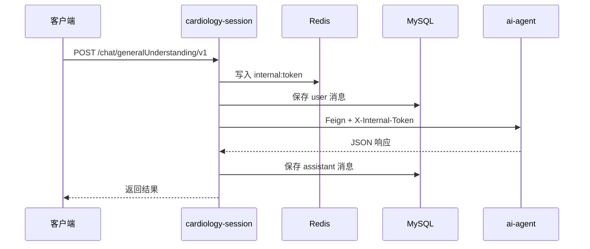

<div align="center">

# ☕ cardiology-cloud

**心血管智能问诊 · Java 中间层**

[](https://openjdk.org/)
[](https://spring.io/projects/spring-boot)
[](https://spring.io/projects/spring-cloud)
[](https://nacos.io/)
[](https://baomidou.com/)
[](https://www.mysql.com/)
[](https://redis.io/)

`services/cardiology-cloud/`

[简介](#简介) · [模块](#模块结构) · [启动](#快速开始) · [API](#api-文档)

</div>

---

## 简介

`cardiology-cloud` 是心血管问诊系统的 Java 侧工程，基于 Spring Boot 多模块构建。

当前可运行服务：**cardiology-session**（端口 `30001`）

**主要职责：**

- 对外 REST API
- OpenFeign 调用 Python `ai-agent`
- Redis 内部 token 鉴权
- MyBatis-Plus 持久化聊天消息

---

## 技术栈

| 类别 | 技术 | 版本 |
|------|------|------|
| 语言 | Java | 17 |
| 框架 | Spring Boot | 3.2.4 |
| 微服务 | Spring Cloud | 2023.0.1 |
| 云原生 | Spring Cloud Alibaba | 2023.0.1.2 |
| 配置中心 | Nacos | 2.x |
| 远程调用 | OpenFeign | — |
| ORM | MyBatis-Plus | 3.5.7 |
| 数据库 | MySQL | 8.0.33 |
| 缓存 | Redis | — |

---

## 模块结构

```text
cardiology-cloud/
├── pom.xml
├── nacos-config/
│   └── cardiology-session-server.yaml
├── cardiology-cloud-common/
│   ├── cardiology-cloud-common-data/      # 全局异常、统一响应
│   ├── cardiology-cloud-common-infra/     # Redis 配置
│   └── cardiology-cloud-common-utils/     # 工具类
└── cardiology-session/                    # 主服务 ✅
    ├── controller/
    ├── services/
    ├── repository/
    ├── entity/
    └── feign/
```

---

## 架构



---

## 快速开始

### 环境

- JDK 17、Maven 3.9+
- MySQL 8、Redis、Nacos
- Python `ai-agent` 已启动（`:8000`）

### 配置

`nacos-config/cardiology-session-server.yaml`：

```yaml
server:
  port: 30001

spring:
  datasource:
    url: jdbc:mysql://127.0.0.1:3306/cardiology?useUnicode=true&characterEncoding=utf8&serverTimezone=Asia/Shanghai
    username: cardiology
    password: cardiology
  data:
    redis:
      host: 127.0.0.1
      port: 6379

cardiology:
  ai-agent:
    base-url: http://127.0.0.1:8000/api/cardiology/
```

### 启动

```bash
cd cardiology-session
mvn spring-boot:run
```

### 编译

```bash
mvn clean package -pl cardiology-session -am
```

---

## API 文档

### POST `/chat/generalUnderstanding/v1`

普通医疗对话。

**请求体：**

```json
{
  "uid": "user-001",
  "session": "session-001",
  "message": "我胸口疼"
}
```

| 字段 | 必填 | 说明 |
|------|------|------|
| `uid` | 是 | 用户 ID |
| `session` | 是 | 会话 ID，对应 LangGraph `thread_id` |
| `message` | 是 | 用户输入 |

**响应：**

```json
{
  "code": 200,
  "message": "success",
  "data": {
    "urgency": "yellow",
    "explanation": "...",
    "advice": "...",
    "disclaimer": "..."
  }
}
```

---

### GET `/chat/messages/v1`

查询会话历史。

**参数：** `uid`、`session`

**响应：** `data` 为消息数组，按 `createdAt` 升序。

---

## 数据库

表 `chat_message`：每轮写入 `user` + `assistant` 两条记录。

| 字段 | 说明 |
|------|------|
| `session_id` | 会话 ID |
| `uid` | 用户 ID |
| `role` | `user` / `assistant` |
| `content` | 消息内容 |
| `urgency` ~ `disclaimer` | assistant 专有字段 |

---

## 字段映射

| Python | Java |
|--------|------|
| `triage_level` | `urgency` |
| `clinical_impression` | `explanation` |
| `management_advice` | `advice` |
| `medical_disclaimer` | `disclaimer` |

---

## 规划

| 模块 | 状态 |
|------|------|
| `cardiology-session` | ✅ 已完成 |
| `cardiology-gateway` | 📋 规划中 |
| `cardiology-auth` | 📋 规划中 |

---

<div align="center">

[← 项目根目录](../../README.md) · [Python AI 服务 →](../ai-agent/README.md)

</div>
